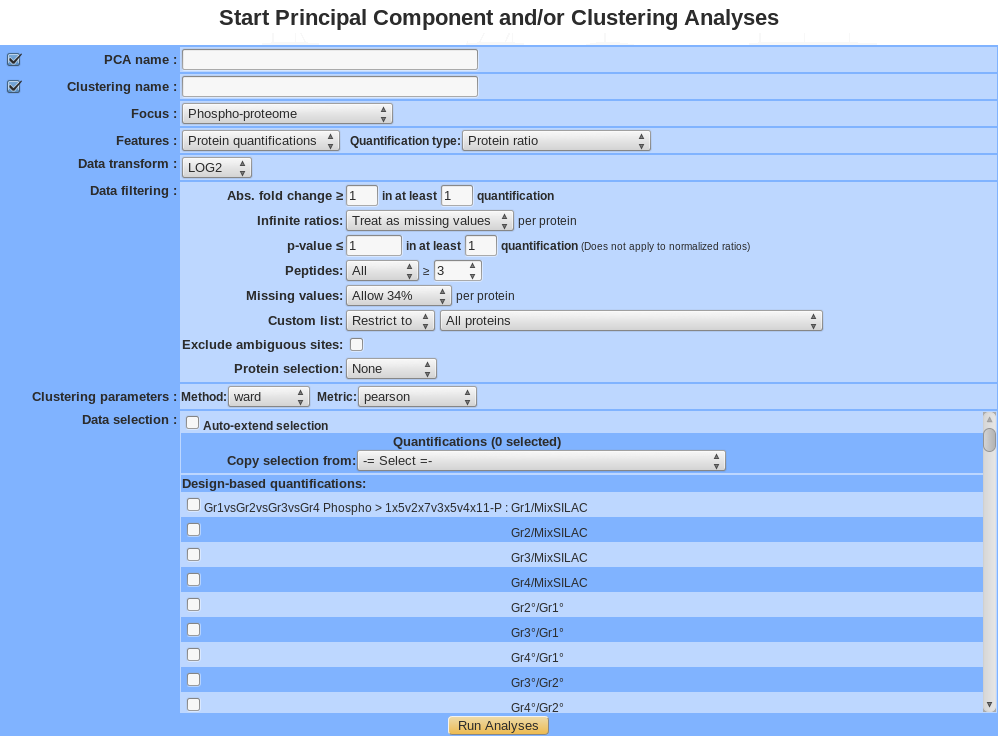
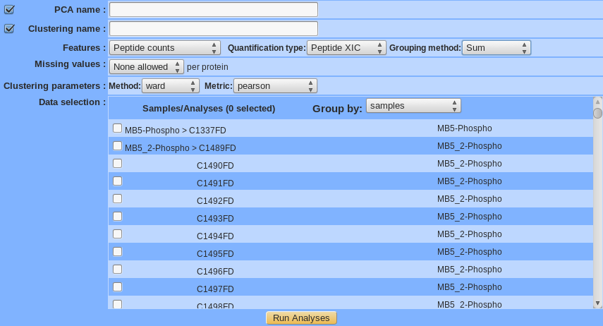
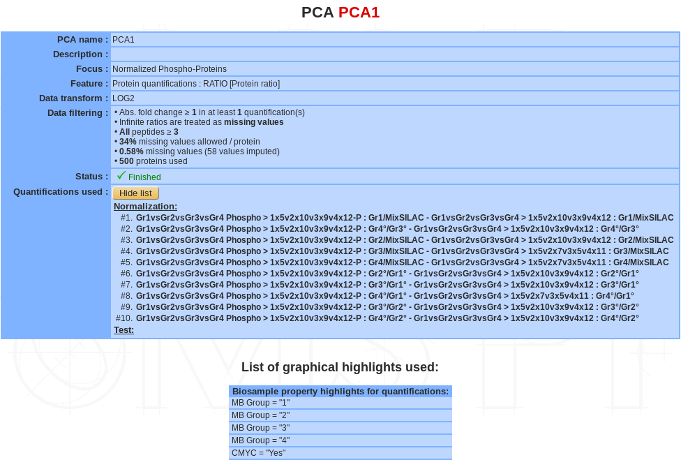
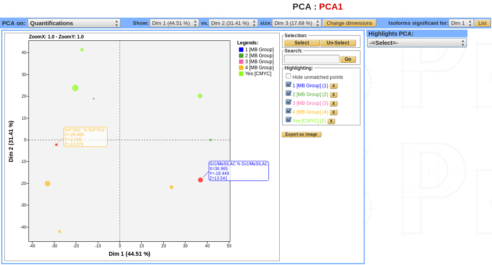
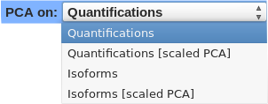
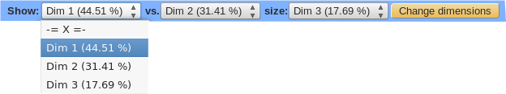
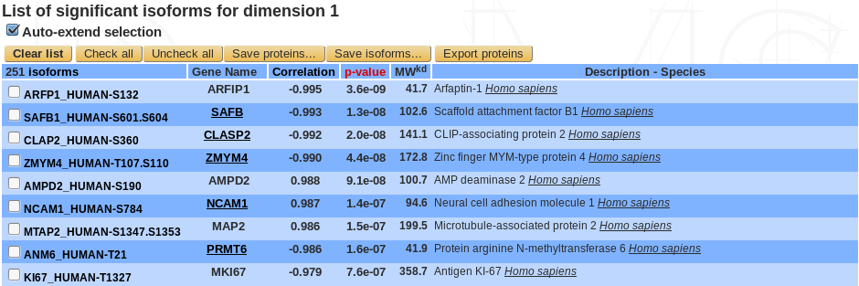
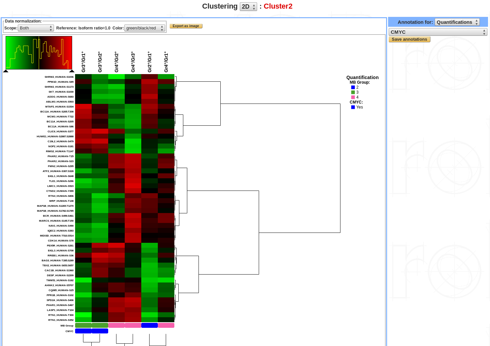

Exploratory analysis
====================

In statistics, **exploratory data analysis (EDA)** is an approach to analyzing data sets to summarize their main characteristics, often with visual methods. 
A statistical model can be used or not, but primarily EDA is for seeing what the data can tell us beyond the formal modeling or hypothesis testing task.
Two types of exploratory analyses are available in *myProMS* : **Principal Component Analysis (PCA)** and **Clustering**. 
They can be launch on **protein quantification** or **peptide count/abundance** datasets.

Launching exploratory analyses on protein quantification
--------------------------------------------------------

First select the Experiment containing the dataset to analyze. Then click on the ``Start Exploratory Analyses`` button. 
The following form will be displayed:

	
-	**Name**: Provide a name for the PCA and/or the clustering analysis. The analysis is saved and can be retrieved by this name in the Exploratory analyses tree displayed in the sub-navigation frame. 
-	**Focus**: 3 types of data can be analyze, Proteins, Proteins modifications (phosphorylation , acetylation….) and Normalized proteins modifications.
-	**Features**: run exploratory analysis on Protein quantifications or Peptide count.
-	**Quantification type**: Select one the protein quantification methods available as listed below:

.. rst-class:: align-center

+------------------------------------------------+
| Quantification type for protein quantification |
+==============================+=================+
| emPAI                        | emPAI           |
+                              +-----------------+
|                              | emPAI (Mol %)   |
+                              +-----------------+
|                              | emPAI (Mr %)    |
+------------------------------+-----------------+
| MaxQuant Intensities         | Intensities     |
+                              +-----------------+
|                              | iBAQ            |
+                              +-----------------+
|                              | LFQ             |
+                              +-----------------+
|                              | MS/MS count     |
+------------------------------+-----------------+
| Normalized spectral index    | SIN             |
+------------------------------+-----------------+
| Protein ratio                | Protein ratio   |
+------------------------------+-----------------+

-	**Data transform**: by default data are not logged, user can transform data in log2 or log10. This is critical, in particular for protein ratio in order to make ratio data symmetrical and centered on 1 (0 in log mode)
-	**Data filtering**:
	- Abs. fold change in at least n quantifications (only for protein ratio): Only proteins with an absolute fold change (before log) greater than or equal to the value provided found in at least n quantifications will be kept .
	- Infinite ratios (only for protein ratio): choose how to deal with infinite ratios. 
	- p-value in at least n quantifications (only for protein ratio): Only proteins with p-value lesser than or equal to the value provided found in n quantifications will be kept.
	- Peptides: Select the counting method: All, Distinct, Razor, ... (the exact list of available options depends of the quantification method selected) and the minimum value allowed in a quantification to consider the protein to be present or absent.
	- Missing values: choose how to deal with missing values. Different options are available: None allowed, Allow x%, Allow all. Value is per individual proteins across dataset. Proteins with more missing values than allowed will be excluded.
	- Exclude ambiguous site (only for modifications proteins): exclude or not sites with ambiguous (uncertain) modification position (ambiguous site contains “~” eg, xxx-254~262:1/5).
	- Aggregate (by best modifications sites, only for modifications proteins): keep only 1 modification site per protein (gene). The site with the highest variance across the dataset will be kept as a proxy for the whole protein (gene).
-	**Protein filtering**:
	- Custom list: by default all proteins that passed above filters are used for the analysis. It is also possible to focus only or exclude a set of proteins based on the custom list selected.
	- Keep n most changing proteins: Only the n proteins with highest variance across the dataset will be kept. 
-	**Clustering parameters**: choose the method and the metric parameters (default method is “Ward” and metric is “pearson”)
-	**Data selection**: choose the quantifications to analyze.
	-	Auto-extend selection: after selecting a quantification, all the following ones are automatically selected (or unselected).
	-	Copy selection: copy the dataset used in a previously performed exploratory analysis.

Launching exploratory analyses on peptides count
------------------------------------------------

-	**Name**: Provide a name for the PCA and/or the clustering analysis. The analysis is saved and can be retrieved by this name in the Exploratory analyses tree displayed in the sub-navigation frame. 
-	**Features**: run exploratory analysis on protein quantifications or peptide count
-	**Quantification type**: different types of quantification are available.
-	**Peptide ID**: <to be completed>
-	**Peptide Count**: <to be completed>
-	**Spectral Count**: <to be completed>
-	**Peptide XIC**: <to be completed>
-	**Grouping method**: 4 methods are available (except for peptide ID).
-	**Min.** <to be completed>
-	**Max.**  <to be completed>
-	**Mean** <to be completed>
-	**Sum**  <to be completed>
-	**Missing values**: choose how to deal with missing values. Different options are available: "None allowed", "Allow x%", "Allow all".
-	**Clustering parameters**: choose the method and the metric parameter (by default, method is "Ward" and metric is "pearson").

Principal Component Analysis (PCA)
----------------------------------

**Principal component analysis (PCA)** is a statistical procedure that uses an orthogonal transformation to convert a set of observations of possibly correlated variables into a set of values of linearly uncorrelated **variables called principal components**.

The number of distinct principal components is equal to the smaller of the number of original variables or the number of observations minus one. This transformation is defined in such a way that the first principal component has the largest possible variance (that is, accounts for as much of the variability in the data as possible), and each succeeding component in turn has the highest variance possible under the constraint that it is orthogonal to the preceding components. 

The resulting vectors are an uncorrelated orthogonal basis set. PCA is sensitive to the relative scaling of the original variables.	

Summary / edit / delete
^^^^^^^^^^^^^^^^^^^^^^^

If a PCA analysis is selected, a summary of the information available for that analysis is displayed in the mainframe.

-	**PCA name**
-	**Description**
-	**Focus**
-	**Features**
-	**Data transform**
-	**Data Filtering**
-	**Status**: There are 3 possible status: Ongoing, Finished or Error
-	**Quantifications used**: list of quantifications used for the analysis (or name of the list)
-	List of graphical highlight used (see below).

The PCA name and the description can be modify by clicking the ``Edit`` button.
The analysis can be deleted by clicking the ``Delete`` button.

Displaying a PCA
^^^^^^^^^^^^^^^^

PCA can be viewed with 4 differents options:
	-	Quantifications view.
	-	Quantifications scaled view.
	-	Protein (or isoforms for modification sites) view.
	-	Protein scaled (or isoforms scaled if modifications sites).

The PCA dimensions can be changed, a 2.1D view is available by selecting a third dimension. 
In this case, the points' size becomes proportional to the values of the selected dimension.

.. danger::
	Add the new PCA 3D display

For each dimension the list of proteins (or isoforms) can be displayed.

.. danger::
	<annotation highlight <to be completed>>

2D-Clustering
-------------

**Cluster analysis** or **clustering** is the task of grouping a set of objects in such a way that objects in the same group (called a cluster) are more similar (in some sense) to each other than to those in other groups (clusters).

Summary / edit / delete
^^^^^^^^^^^^^^^^^^^^^^^

The summary part of clustering is exactly the same than the PCA summary plus the information of clustering parameters.

Displaying clustering
^^^^^^^^^^^^^^^^^^^^^

.. danger::
	<description clustering <to be completed>>
