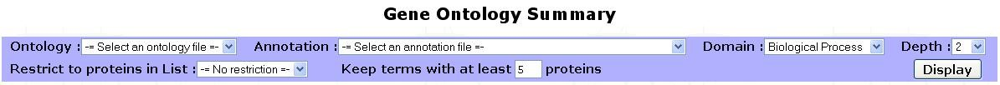
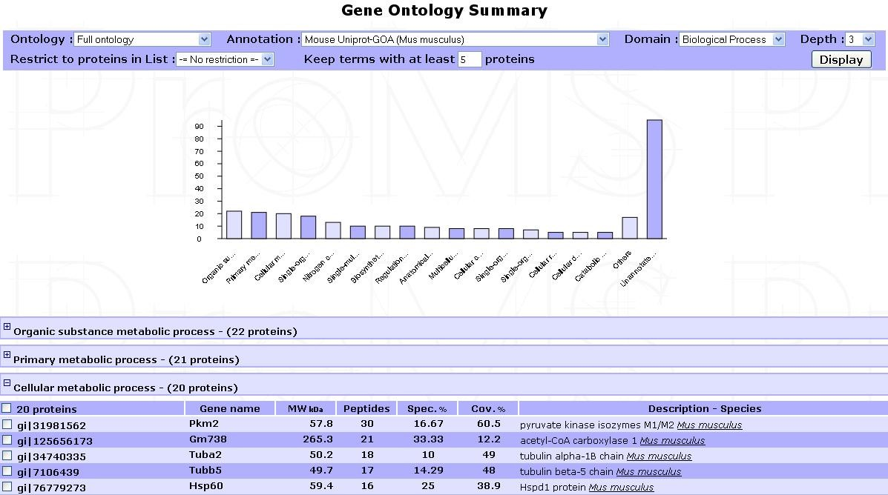
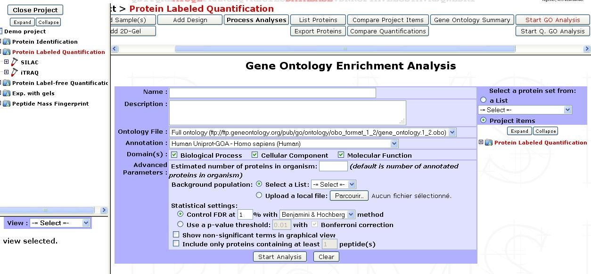
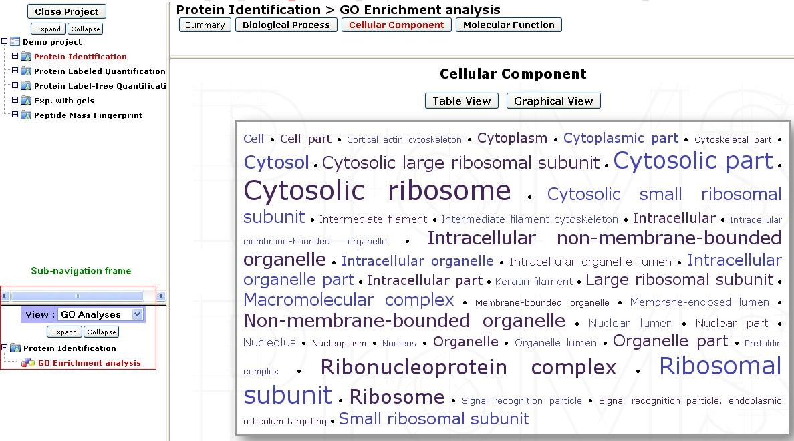
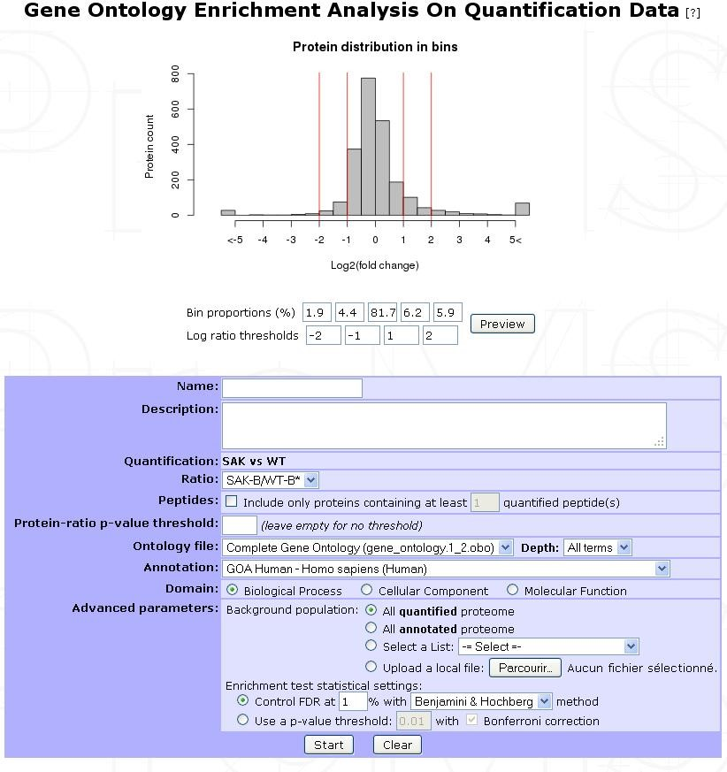
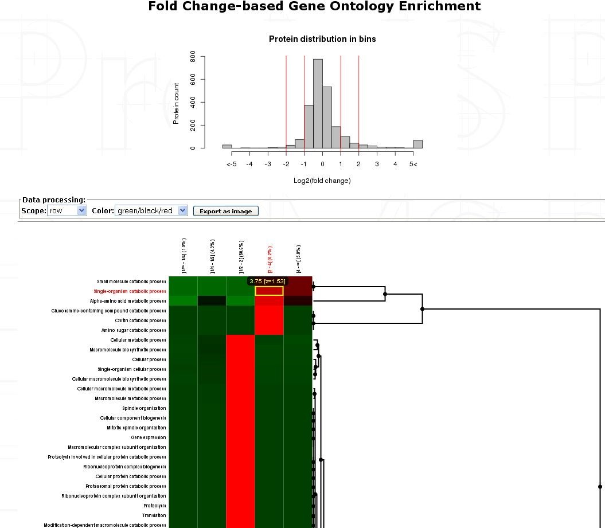

Gene Ontology
-------------

Different types of analyses using **Gene Ontology (GO)** can be performed on validated protein lists. 
The GO project provides a controlled vocabulary of terms for describing gene products such as proteins. 
For more details, see the `GO website <http://www.geneontology.org/>`_. 
A GO analysis can regroup proteins into standardized categories of terms belonging to 3 domains: **Biological Process**, **Cellular Component** and **Molecular Function**. 

In myProMS, all GO analyses need 2 types of GO files that are managed from GO files management section (See corresponding chapter below for more information) :
	
- **Ontology file**: the file that contains all term descriptions and their relationships between each other
- **Annotation file**: the file that maps each protein identifier to the most specific terms that characterize the protein.

GO summary
^^^^^^^^^^

The GO summary tool can be used to simply regroup proteins sharing common GO terms.
This tool can be run from the option frame on any project item, by clicking on the ``Gene Ontology summary`` button. The following form is then displayed:

+-------------------------------------+--------------------------------------------------------------------------------------------------------------------------------------------------------------------------------------------------------------------------------------------------------------------------------------------------------------------+
| Ontology                            | The file containing terms that will be used to regroup proteins                                                                                                                                                                                                                                                    |
+-------------------------------------+--------------------------------------------------------------------------------------------------------------------------------------------------------------------------------------------------------------------------------------------------------------------------------------------------------------------+
| Annotation                          | The file containing protein annotations to GO terms                                                                                                                                                                                                                                                                |
+-------------------------------------+--------------------------------------------------------------------------------------------------------------------------------------------------------------------------------------------------------------------------------------------------------------------------------------------------------------------+
| Domain                              | Select one of the 3 GO domains the analysis will be focused on                                                                                                                                                                                                                                                     |
+-------------------------------------+--------------------------------------------------------------------------------------------------------------------------------------------------------------------------------------------------------------------------------------------------------------------------------------------------------------------+
| Depth                               | Only terms at the specified depth in the GO graph structure will be used. Depth is calculated by counting the distance between a term and the root term of the corresponding ontology domain. If a high depth is selected, a very large number of terms will be displayed and the results may be difficult to read |
+-------------------------------------+--------------------------------------------------------------------------------------------------------------------------------------------------------------------------------------------------------------------------------------------------------------------------------------------------------------------+
| Minimal protein per term (Optional) | If a selected term contains less proteins that this specified value, this term will be ignored and the matching proteins will be added to the "Other" category                                                                                                                                                     |
+-------------------------------------+--------------------------------------------------------------------------------------------------------------------------------------------------------------------------------------------------------------------------------------------------------------------------------------------------------------------+
 
Click on ``Display`` to launch the process. After a short calculation time, results are displayed as shown in the example below:

 
An interactive bar plot shows each term frequency. Click on a bar to display the proteins mapped to the corresponding term. Each protein group can also be viewed by browsing the list of terms displayed below the plot.

GO enrichment analysis
^^^^^^^^^^^^^^^^^^^^^^

Enrichment analysis is performed to determine which GO terms are significantly enriched in a **tested set** of proteins when compared with a given **background set** (eg. the whole proteome of the species studied). All terms will be tested regardless of their depth.
In myProMS, GO enrichment analysis is calculated with the GO\:\:TermFinder package developed for perl\ [1]_. Briefly, a p-value using a hypergeometric distribution is computed to determine whether any GO terms annotate a specified list of proteins at a frequency greater than that would be expected by chance. Multiple hypothesis correction is available with FDR computing.
This tool is accessible by clicking on an experiment and selecting the ``Start GO Analysis`` button in the option frame. The following form in then displayed:

+------------------------+--------------------------------------------------+---------------------------------------------------------------------------------------------------------------------------------------------------------------------------------------------------------------------------------------------------------------------------------------------------------------------------------------------------------------------------------------------------------------------------------------------------------------------------------------------------------------------------------------------------------------------------------------------------------------------------------------------------------------------------------------------------------------------------------------------------------------------------------------------------------------------------------------------------------------------+
| Name                   | Provide a name for the enrichment analysis. The analysis is saved and can be retrieved by this name in the GO analyses tree displayed in the sub-navigation frame                                                                                                                                                                                                                                                                                                                                                                                                                                                                                                                                                                                                                                                                                                                                                      |
+------------------------+--------------------------------------------------+---------------------------------------------------------------------------------------------------------------------------------------------------------------------------------------------------------------------------------------------------------------------------------------------------------------------------------------------------------------------------------------------------------------------------------------------------------------------------------------------------------------------------------------------------------------------------------------------------------------------------------------------------------------------------------------------------------------------------------------------------------------------------------------------------------------------------------------------------------------------+
| Description (Optional) | Description of the current analysis                                                                                                                                                                                                                                                                                                                                                                                                                                                                                                                                                                                                                                                                                                                                                                                                                                                                                    |
+------------------------+--------------------------------------------------+---------------------------------------------------------------------------------------------------------------------------------------------------------------------------------------------------------------------------------------------------------------------------------------------------------------------------------------------------------------------------------------------------------------------------------------------------------------------------------------------------------------------------------------------------------------------------------------------------------------------------------------------------------------------------------------------------------------------------------------------------------------------------------------------------------------------------------------------------------------------+
| Ontology file          | The file containing term relationships                                                                                                                                                                                                                                                                                                                                                                                                                                                                                                                                                                                                                                                                                                                                                                                                                                                                                 |
+------------------------+--------------------------------------------------+---------------------------------------------------------------------------------------------------------------------------------------------------------------------------------------------------------------------------------------------------------------------------------------------------------------------------------------------------------------------------------------------------------------------------------------------------------------------------------------------------------------------------------------------------------------------------------------------------------------------------------------------------------------------------------------------------------------------------------------------------------------------------------------------------------------------------------------------------------------------+
| Domain(s)              | Select one or more domains to test                                                                                                                                                                                                                                                                                                                                                                                                                                                                                                                                                                                                                                                                                                                                                                                                                                                                                     |
+------------------------+--------------------------------------------------+---------------------------------------------------------------------------------------------------------------------------------------------------------------------------------------------------------------------------------------------------------------------------------------------------------------------------------------------------------------------------------------------------------------------------------------------------------------------------------------------------------------------------------------------------------------------------------------------------------------------------------------------------------------------------------------------------------------------------------------------------------------------------------------------------------------------------------------------------------------------+
| Advanced parameters    | Estimated number of proteins in organism         | If the background population consists of the whole proteome (more exactly the whole protein set contained in the annotation file), this value can be set to calculate properly the enrichment ratio of GO terms in the tested  protein set(s), supposing that the annotation file is incomplete. This option artificially adds unannotated proteins to the background                                                                                                                                                                                                                                                                                                                                                                                                                                                                                               |
+ (Optional)             +--------------------------------------------------+---------------------------------------------------------------------------------------------------------------------------------------------------------------------------------------------------------------------------------------------------------------------------------------------------------------------------------------------------------------------------------------------------------------------------------------------------------------------------------------------------------------------------------------------------------------------------------------------------------------------------------------------------------------------------------------------------------------------------------------------------------------------------------------------------------------------------------------------------------------------+
|                        | Background population                            | Select the population to which the tested protein set will be compared. A previously built custom list can be selected, or a local file can be used instead. This file must contains all protein identifiers that compose the background (1 identifier per row). These identifiers must match the ones contained in the annotation file. If selected background is set to “Unspecified”, the whole protein set contained in the annotation file will be used as background. In this case, be sure that the annotation file contains only proteins from the current species. This can be considered as a whole proteome background if the annotation has a very good coverage of current species proteome. The background population selection strongly affects the significance of terms and must be chosen carefully and coherently with your biological question  |
+                        +--------------------------------------------------+---------------------------------------------------------------------------------------------------------------------------------------------------------------------------------------------------------------------------------------------------------------------------------------------------------------------------------------------------------------------------------------------------------------------------------------------------------------------------------------------------------------------------------------------------------------------------------------------------------------------------------------------------------------------------------------------------------------------------------------------------------------------------------------------------------------------------------------------------------------------+
|                        | Statistical settings                             | These settings can be set to control the significance cut-off of GO terms. False Discovery Rate (FDR) or p-value criteria can be selected.                                                                                                                                                                                                                                                                                                                                                                                                                                                                                                                                                                                                                                                                                                                          |
+                        +--------------------------------------------------+---------------------------------------------------------------------------------------------------------------------------------------------------------------------------------------------------------------------------------------------------------------------------------------------------------------------------------------------------------------------------------------------------------------------------------------------------------------------------------------------------------------------------------------------------------------------------------------------------------------------------------------------------------------------------------------------------------------------------------------------------------------------------------------------------------------------------------------------------------------------+
|                        | Show non-significant terms in graph              | If this option is disabled, non-significant terms will be represented with small dots in graphical view. This can increase significantly the visibility of the graph if the dataset contains a large number of significant terms                                                                                                                                                                                                                                                                                                                                                                                                                                                                                                                                                                                                                                    |
+                        +--------------------------------------------------+---------------------------------------------------------------------------------------------------------------------------------------------------------------------------------------------------------------------------------------------------------------------------------------------------------------------------------------------------------------------------------------------------------------------------------------------------------------------------------------------------------------------------------------------------------------------------------------------------------------------------------------------------------------------------------------------------------------------------------------------------------------------------------------------------------------------------------------------------------------------+
|                        | Include only proteins with at least n peptide(s) | Proteins which contains less peptides than the value specified will be excluded from the tested set                                                                                                                                                                                                                                                                                                                                                                                                                                                                                                                                                                                                                                                                                                                                                                 |
+------------------------+--------------------------------------------------+---------------------------------------------------------------------------------------------------------------------------------------------------------------------------------------------------------------------------------------------------------------------------------------------------------------------------------------------------------------------------------------------------------------------------------------------------------------------------------------------------------------------------------------------------------------------------------------------------------------------------------------------------------------------------------------------------------------------------------------------------------------------------------------------------------------------------------------------------------------------+
| Select a protein set   | Select the protein set to be tested. It can be selected from any project item or custom list                                                                                                                                                                                                                                                                                                                                                                                                                                                                                                                                                                                                                                                                                                                                                                                                                           |
+------------------------+--------------------------------------------------+---------------------------------------------------------------------------------------------------------------------------------------------------------------------------------------------------------------------------------------------------------------------------------------------------------------------------------------------------------------------------------------------------------------------------------------------------------------------------------------------------------------------------------------------------------------------------------------------------------------------------------------------------------------------------------------------------------------------------------------------------------------------------------------------------------------------------------------------------------------------+

Once all parameters have been set, click on ``Start Analysis``. The computation may last several minutes depending on the sizes of the protein sets being compared.
The results are directly displayed after the process but can also be accessed later on by selecting the analysis name in the GO analyses tree displayed in the sub-navigation frame.

 
For each domain, results can be displayed in 3 different views accessible at the top of the page:

- **Cloud view**: Highly significant terms (low p-value) are represented with a large font, and less significant terms with a small font. The proteins mapped to a term can be listed by clicking and each term.
- **Table view**: More details can be viewed in table format which contains the p-value and enrichment ratio of each term.
- Graph view: Displays a graph of the significant terms as nodes with their relationships as edges. Each node colour is based on the corresponding term’s p-value significance. Proteins that are mapped to a term can be viewed by clicking on the corresponding node.

Quantitative gene enrichment analysis
^^^^^^^^^^^^^^^^^^^^^^^^^^^^^^^^^^^^^

When a quantification is available, a quantitative gene enrichment analysis can be performed as it was originally done for SILAC experiments\ [2]_.
The quantified proteome is divided into five bins corresponding to log2 ratios or bin proportion. Enrichment of GO terms in each bin is then calculated compared to a provided background and a cluster analysis allow to visualize a heatmap of enriched GO-terms in all bins.
Here is how you should proceed to do it.
This option is accessible by clicking on an experiment and selecting the ``Start Q. GO Analysis`` button in the option frame. After loading a protein set of an Analysis or a Design related quantification, you need to select the parameters in the following form:

+---------------------------------+--------------------------------------+----------------------------------------------------------------------------------------------------------------------------------------------------------+
| Name                            | Provide a name for the enrichment analysis. The analysis is saved and can be retrieved by this name in the GO analyses tree displayed in the sub-navigation frame                               |
+---------------------------------+--------------------------------------+----------------------------------------------------------------------------------------------------------------------------------------------------------+
| Description (Optional)          | Description of the current analysis                                                                                                                                                             |
+---------------------------------+--------------------------------------+----------------------------------------------------------------------------------------------------------------------------------------------------------+
| Ratio                           | Choose the ratio considered for the enrichment in the quantitation (like heavy/medium or heavy/light for SILAC experiments).                                                                    |
+---------------------------------+--------------------------------------+----------------------------------------------------------------------------------------------------------------------------------------------------------+
| Peptides (Optional)             | Make a threshold upon the number of peptides used to compute the ratio                                                                                                                          |
+---------------------------------+--------------------------------------+----------------------------------------------------------------------------------------------------------------------------------------------------------+
| Protein-ratio p-value threshold | Make a selection on the associated p-value of the ratio                                                                                                                                         |
+---------------------------------+--------------------------------------+----------------------------------------------------------------------------------------------------------------------------------------------------------+
| Ontology file                   | The file containing term relationships                                                                                                                                                          |
+---------------------------------+--------------------------------------+----------------------------------------------------------------------------------------------------------------------------------------------------------+
| Annotation                      | The file containing protein annotations to GO terms                                                                                                                                             |
+---------------------------------+--------------------------------------+----------------------------------------------------------------------------------------------------------------------------------------------------------+
| Domain                          | Select one domain to test                                                                                                                                                                       |
+---------------------------------+--------------------------------------+----------------------------------------------------------------------------------------------------------------------------------------------------------+
| Advanced parameters             | Background population                | Select the population to which the tested protein set will be compared. See GO enrichment analysis section for custom list recommendations               |
+ (Optional)                      +--------------------------------------+----------------------------------------------------------------------------------------------------------------------------------------------------------+
|                                 | Enrichment test statistical settings | These settings can be set to control the significance cut-off of GO terms. False Discovery Rate (FDR) or p-value criteria can be selected                |
+---------------------------------+--------------------------------------+----------------------------------------------------------------------------------------------------------------------------------------------------------+

When the enrichment is done, you can get information of the GO-Analysis by clicking on the sub-navigation frame the item generated and Summary. 

Click on the ``Heatmap`` button to see the output you can get:

 
Each row represent a GO-Term and each cell is the -log10 of the p-value of the enrichment test for the GO-Term in the specific bin (put to 1 and then log-transformed to 0 if that ontology is not enriched/significant in the bin). 

Each line is z-scored. Then, these z-scores are clustered by one-way hierarchical clustering using the function hclust in R (the distance function used is **euclidean** and the agglomeration method used is **average**).

.. note:: 
	The heatmap is interactive and can be exported as a jpeg image. Clicking on a cell updates the frame and provides the list of proteins containing the annotated GO-Term in the bin.

--------------------------------------------------

.. [1] GO\:\:TermFinder package : `Boyle et al., Bioinformatics, 2004 <http://bioinformatics.oxfordjournals.org/content/20/18/3710.long>`_
.. [2] Quantitative GO SILAC : `Pan C et al, MCP, 2009 <http://www.ncbi.nlm.nih.gov/pubmed/18952599>`_