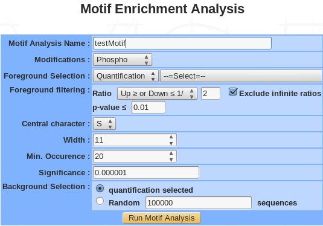
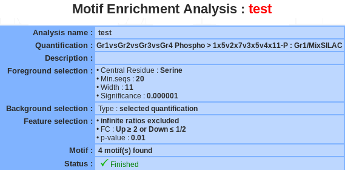
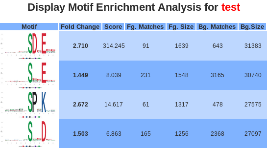
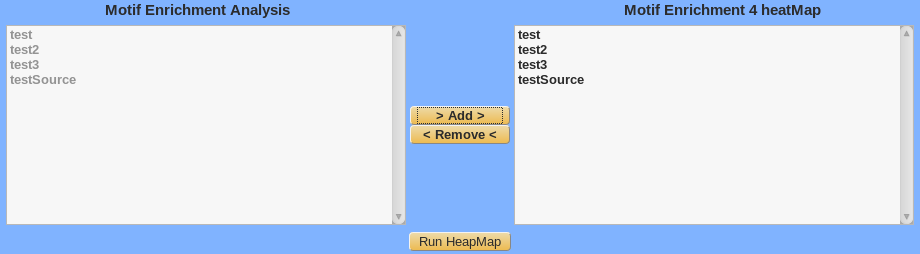
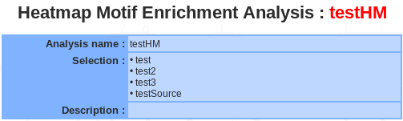
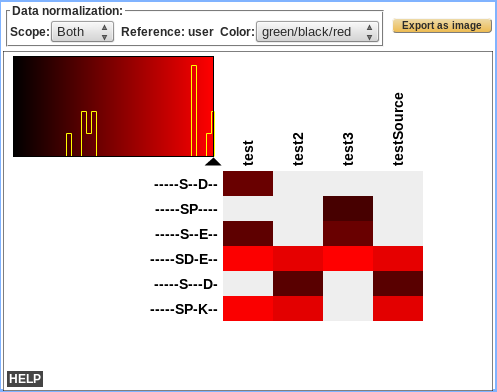

Motif enrichment analysis
-------------------------

Motifs are recurring short sequence elements. 
Their over-representation usually implies some functional significance. 
*myProMS* uses `rmotifx <https://github.com/omarwagih/rmotifx>`_ R package for the enrichment analysis and `ggseqlogo <https://github.com/omarwagih/ggseqlogo>`_ R package for drawing the motif.

Launch analysis
^^^^^^^^^^^^^^^

-	**Name**: provide a name for the PCA and/or the clustering analysis. The analysis is saved and can be retrieved by this name in the Exploratory analyses tree displayed in the sub-navigation frame. 
-	**Modification**: choose the type of modifications (phosphorylation, acetylation, methylation….).
-	**Foreground selection**: select a quantification or a previously saved list.
-	**Foreground filtering**:
	
	*	Ratio: all proteins with a ratio corresponding to the chosen value are kept.
	*	Infinite ratio: exclude or not.
	
-	**p-value**: all proteins with a p-value smaller than or equal to the chosen value are kept.
-	**Central residue**: following the type of modifications, the drop down menu is automatically generated. For instance, phosphorylation modification generate 3 type of residue (S, T, Y).
-	**Width**: the width is the number of total characters is the motif. It should be an odd number between 3 and 35. However, choosing a motif width that is too narrow can result in the exclusion of motifs with critical longer-range dependencies and choosing a motif width that is too wide (without adjusting the significance threshold accordingly) can yield spurious motif results.
-	**Min. occurrence**: the occurrence threshold refers to the minimum number of times you wish each of your extracted motifs to occur in the data set. An occurrence threshold of 20 usually is appropriate, although this parameter may be adjusted to yield more specific or less specific motifs. This parameter can be used to tune the specificity of motifs since motifs with greater specificity (i.e., more “fixed” positions) are expected to occur less often than those motifs with lower specificity. Users that wish to extract a maximal number of motifs should set this parameter to a low value (for example, “5”) and rely solely on the significance parameter (see step 8) to extract motifs. On occasion it may be useful to set this parameter as a fractional percent of the total number of modification sites in order to compare motifs with similar specificities across data sets that vary in size (e.g., to compare motifs from data sets of 300 and 3000 sites, one may opt to set the occurrences parameter to 5 and 50, respectively).
-	**Significance**: The significance refers to the P-value threshold for the binomial probability. This is used for the selection of significant residue/position pairs in the motif.  t is critical to note that this value does not take into account a correction for multiple hypotheses (such as the Bonferroni correction). On any given motif-x search step there are (number of possible characters at each position) * (number of non fixed positions) hypotheses being tested. For example, in an S-centered analysis of width 15, there would be (20) * (14) = 280 hypotheses tested. To ensure an alpha-value of at least 0.05 by the Bonferroni method, one would need to divide the desired alpha-value by the total number of hypotheses tested (i.e., 0.05/280 = 0.00018).We suggest a threshold of 0.000001 to maintain a low false positive rate in standard protein motif analyses.
-	**Background selection**: The background simply refers to the  item from which the data set was taken. This is important for accurate statistical analysis. You may choose the selected quantification or generate a random background sequence based on the probability of each amino acid within the proteome.

Summary/editing/deleting
^^^^^^^^^^^^^^^^^^^^^^^^

If a motif enrichment analysis is selected, a summary of the information available for that analysis is displayed in the mainframe.

The motif name and the description can be modify by clicking the ``edit`` button.
The analysis can be deleted by clicking the ``delete`` button.

.. important::
	If the motif analysis is involved in a heatmap, you have to delete the heatmap before deleting the motif analysis.

Displaying motif enrichment
^^^^^^^^^^^^^^^^^^^^^^^^^^^

	
-	Motif: the logo picture made by ggseqlogo with the over-represented motif. Motif positions are labeled below the x-axis and residues are colored according to their chemical and physical properties.
-	Fold change:  is an indicator of the enrichment level of the extracted motifs. Specifically, it is calculated as (foreground matches/foreground size)/(background matches/background size).
-	Score: The “motif score” is calculated by taking the sum of the negative log probabilities used to fix each position of the motif. As such, higher motif scores typically correspond to motifs that are more statistically significant as well as more specific (i.e., greater number of fixed positions).
-	Fg. matches / Bg. matches: indicate the number of peptides containing a given motif in those respective data sets following the removal of all peptides containing previously extracted motifs. Because of this iterative “set reduction” strategy, the “foreground matches” and “background matches” statistics may be less than or equal to the total number of instances of a given motif in the whole data set.
-	Fg. size / Bg. size: indicate the total number of peptides contained in these data sets. The size of these data sets decreases as motifs are extracted (i.e., down a column) due to the fact that peptides are removed from both the foreground and background data sets following motif extraction. The total number of foreground peptides not falling into any extracted motif class can therefore be calculated as the difference between the “foreground size” and the “foreground matches” of the final motif class (e.g., 163 – 32 = 131 unclassified peptides in Figure 5). The “fold increase” statistic is an indicator of the enrichment level of the extracted.

Clicking on either the links in the motif logo, brings users to the peptide data used to extract the given motifs. As such, the number of peptides found for each motif in this section corresponds exactly to the number of “foreground matches” for the motif in appropriate column of the results table.

 
Heatmap motif analysis
^^^^^^^^^^^^^^^^^^^^^^

**Launch HM motif analysis**

Select the previously saved motif analysis in the left panel, click on the ``Add`` button and the selected analysis are moved in the right panel to be cluster.

**Summary / Edit / Delete**

<to be completed>
	
	
**Display Heatmap motif analysis**

<to be completed>