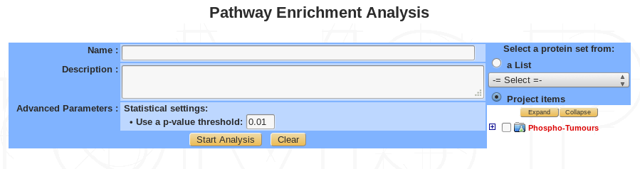
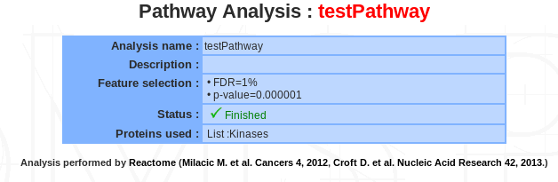
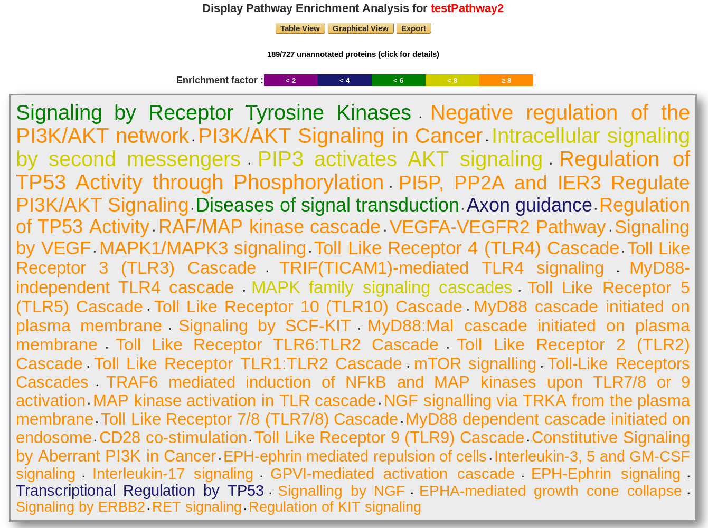
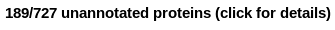
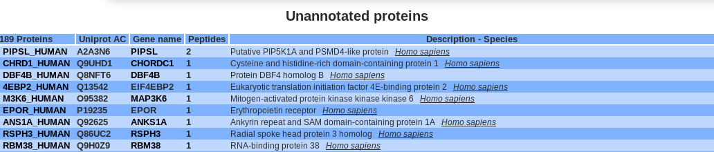
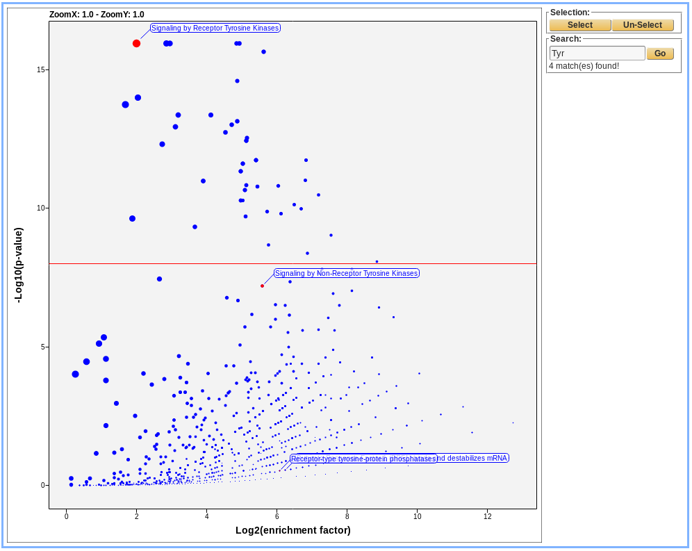
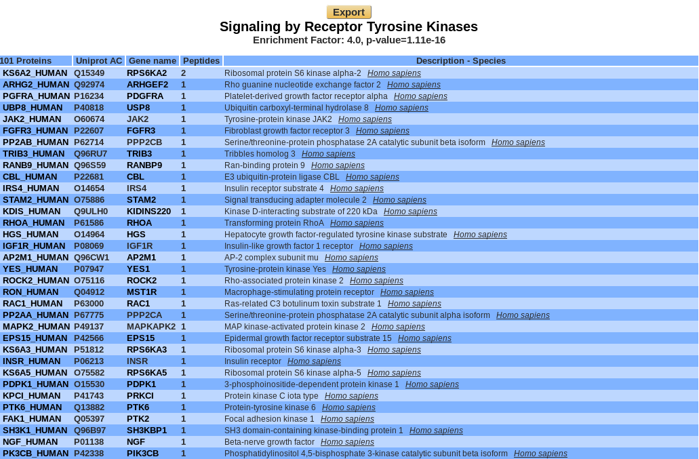
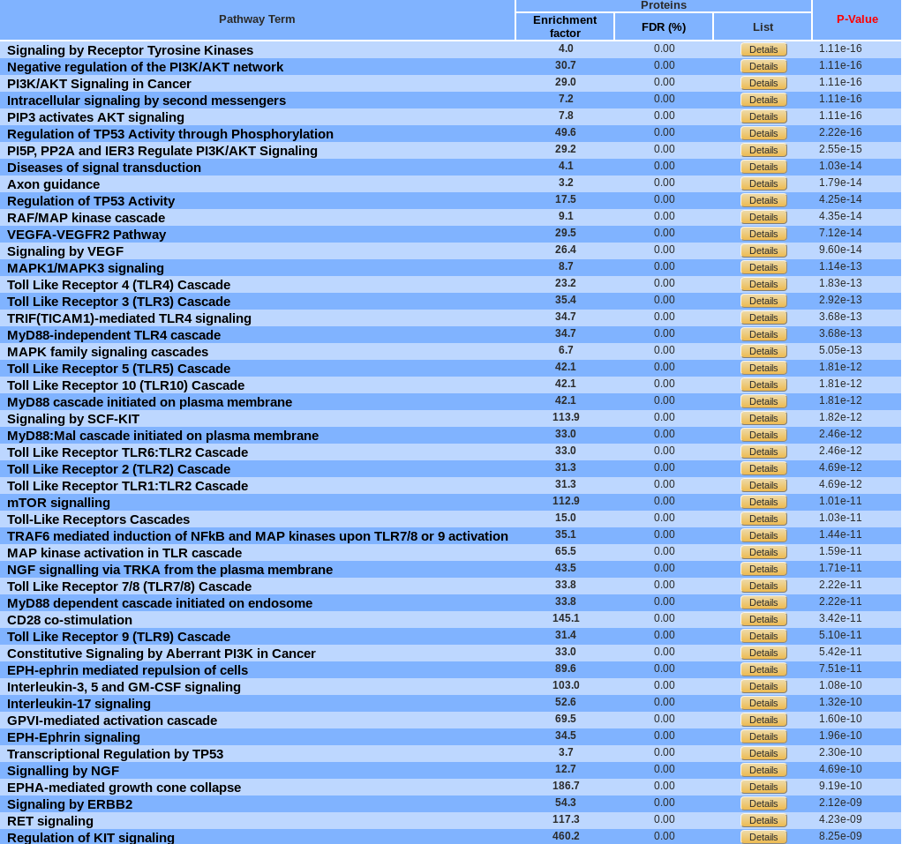
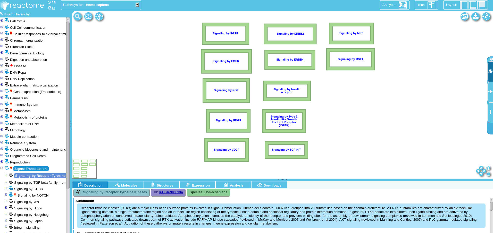

Pathway enrichment
------------------

Pathway is the term from molecular biology which depicts an artificial simplified model of a process within a cell or tissue.
In bioinformatics research, **pathway analysis** is used to identify **related proteins** within a pathway. 
This is helpful when analyzing any omics dataset with a large number of proteins. By examining the changes in proteins in a pathway, its biological causes can be explored.

Typical pathway model starts with extracellular signaling molecule that activates a specific protein. 
Thus triggers a chain of protein-protein or protein-small molecule interactions. 
Pathway analysis helps to understand or interpret omics data from the point of view of canonical prior knowledge structured in the form of pathways diagrams. 
It allows finding distinct cell processes (cellular processes), diseases or signalling pathway that are statistically associated with selection of differentially expressed proteins between two samples.
To do so, *myProms* uses `Reactome <https://reactome.org/documentation>`_'s web-service.

Launch pathway analysis
^^^^^^^^^^^^^^^^^^^^^^^

 
+----------------------+------------------------------------------------------------------------------------------------------------------------------------------------------------------------+
| Name                 | Provide a name for the Pathway analysis. The analysis is saved and can be retrieved by this name in the Functional analyses tree displayed in the sub-navigation frame |
+----------------------+------------------------------------------------------------------------------------------------------------------------------------------------------------------------+
| Description          | Free text                                                                                                                                                              |
| (Optional)           |                                                                                                                                                                        |
+----------------------+------------------------------------------------------------------------------------------------------------------------------------------------------------------------+
| Advanced parameters  | Set a p-value threshold                                                                                                                                                |
| (Optional)           |                                                                                                                                                                        |
+----------------------+------------------------------------------------------------------------------------------------------------------------------------------------------------------------+
| Select proteins      | Select proteins to use in the analysis, from custom list or project item                                                                                               |
+----------------------+------------------------------------------------------------------------------------------------------------------------------------------------------------------------+

Summary / edit / delete
^^^^^^^^^^^^^^^^^^^^^^^

 
If a pathway analysis is selected, a summary of the information available for that analysis is displayed in the mainframe.	

Displaying pathway analysis
^^^^^^^^^^^^^^^^^^^^^^^^^^^

3 different views are available : **Cloud**, **graphical** and **table view** :

**Cloud view :**

	
The displaying pathway is ordered by p-value. The color corresponds to the enrichment factor value. 

Users have access to the unannotated proteins, which does not match with the reactome database.

**Graphical view :**
	

	
.. danger:: 
	A COMPLETER

**Table view :**

By default, pathways are ordered by p-value. They can be sorted by enrichment factor or FDR by clicking the corresponding name.
A pathway can be display in Reactome by clicking on its name.

Export
^^^^^^

An excel file can be downloaded which correspond to the table view information. 
