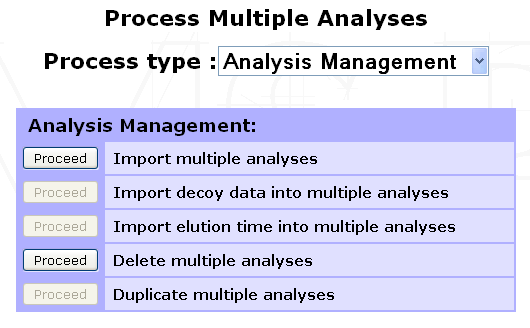
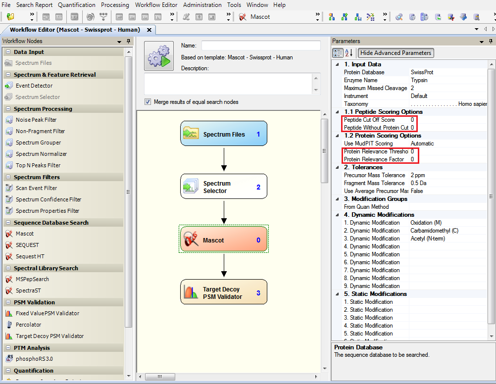
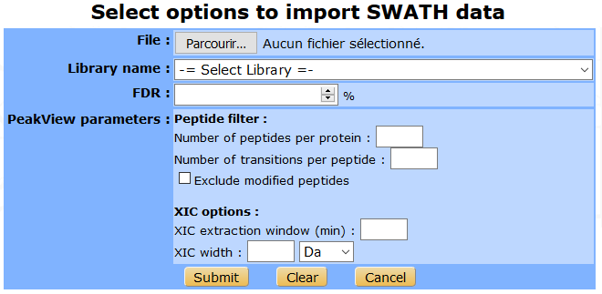
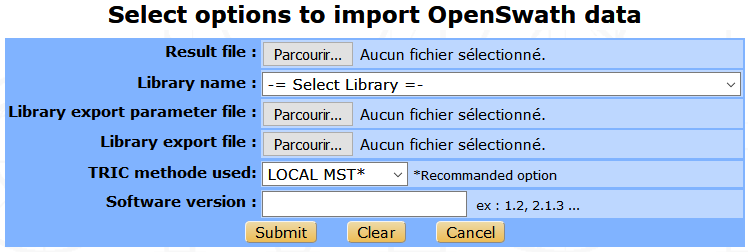
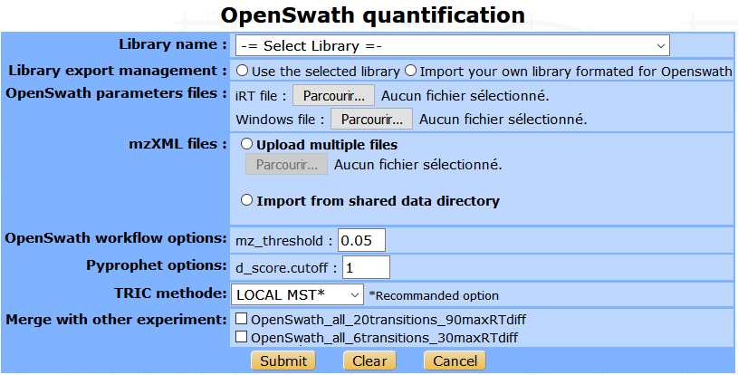
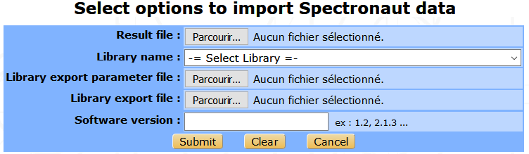
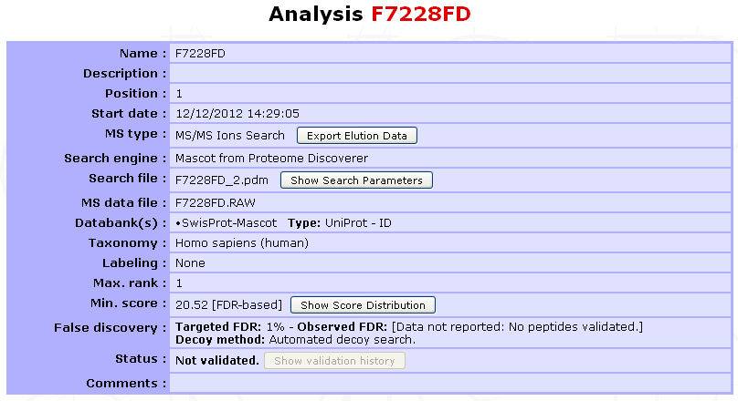

.. _analysis_import:

Analysis import
===============

The collection of spectra/peptides/proteins(/quantification) data contained in a search result file are imported into myProMS as an **Analysis**. 

.. note::
	Only bioinformaticians, massists and managers can import Analyses.
	
Select the **Experiment**, **Sample** or **2D Gel** into which the Analyses must be imported and click ``Process Analyses`` in the option frame. From the selection menu displayed, select ``Analysis Management`` to display the list of available options.

Supported search engines
------------------------

myProMS allows to import from various search engines :
	- Mascot (DAT file or MSF file from Proteome Discoverer Software by Thermo Scientific).
	- Paragon (XML generated from ProteinPilotTM Software by AB SCIEX, group2xml.exe).
	- Sequest (MSF file from Proteome Discoverer Software by Thermo Scientific).
	- Phenyx (XML file generated through Phenyx platform by GeneBio). DEPRECATED!
	- Andromeda/MaxQuant (mqpar.xml and 3-4 txt files are required).
	- X!Tandem (XML file from X! Tandem pipeline (`PAPPSO <http://pappso.inra.fr/bioinfo/xtandempipeline/download.php>`_) or from Trans-Proteomic Pipeline (`TPP <http://tools.proteomecenter.org/wiki/index.php?title=Software:TPP>`_ )).
	- PeakView (Exported Excel XLXS file for SWATH data).
	- OpenSwath (TSV file from `OpenSWATH <http://www.openswath.org/en/latest/>`_ workflow).
	- Spectronaut (TSV file generated from SpectraunotTM by Biognosys).
	
.. attention:: 
	If you perform Mascot searches with Proteome Discoverer (PD) Software, make sure you dit not use Protein and Peptide filters. 
	In the **Workflow Editor**, click on Mascot node and then, set the four filters Peptide Cutt Off Score, `Peptide Without Protein Cut`, `Protein Relevance Threshold` and `Protein Relevance Factor` to 0. 
	If these filters are not turned-off, myProMS import options such as predefined `False Discovery Rate (FDR)` will not be accurate.

 
Collecting search files
-----------------------

Multiple analyses can be imported at once as long as the corresponding searches were performed with the same search engine and protein databank(s).

To select data files in **Mascot**, **Proteome Discoverer** and **X!Tandem**:

Click on ``Proceed`` next to the ``Import multiple analyses`` process as shown below. The following form will be displayed to select the source of the search files to be imported.
 
Multiple import sources are available:
	- **A user directory on server**: Following upload, files are stored in a user-dedicated directory on server. These files will stay available to the user until he decides to delete them; either just after import or later. In the later case the user can still access this directory for file management purpose by clicking on the ``Clean My Directory`` button.
	- **Any directory on server**: This option is available to bioinformaticians only. The user can provide any path on the server where myProMS should look for search results files.
	- **Mascot server**: If a Mascot server is declared in myProMS configuration file, it can be accessed, searched for specific search results and files directly uploaded into myProMS user directory. 

.. image: img/analysis_import_select_source.png

User can search results files by *date* or *job number* range or keywords in the files *search title*. 
The list matching files is then displayed and grouped by day of creation. 
Specific information on a file (name, availability, search title and user ID) can be displayed by clicking on the file name. 
If access to Mascot is restricted (user accounts set up), the Mascot userID must be defined in myProMS as well (see :ref:`account_management`). 

In this case, only Mascot files accessible to the user will be displayed.
	- **Upload Zip archive**: If a large number of files must be imported, they can be uploaded at once as the zip archive. The archive will be unzipped on the server.
	- **Upload multiple files**: Alternatively, up to 10 files can be uploaded as separate files.
	
Once your files have been selected, click on ``Proceed`` to initiate file retrieval from the selected source. This procedure may take a few minutes depending of the number and size of the files. Once the transfer is complete, a file import interface will be displayed.

.. important::
	Most browsers do not support upload of files with (total) size > **2 Gb**. 
	If files larger than 2 Gb must be uploaded, we recommend to use **Google Chrome**. 
	This limitation does not apply when retrieving files directly from a Mascot server.

Import parameters (Mascot, Proteome Discoverer and X!Tandem)
------------------------------------------------------------

Files retrieved are listed in alphabetical order together with pertinent information about the search performed: the MS file, search type (MS2, MS1 or mix of both), databank(s) and taxonomy and search title used.

.. image: img/analysis_import_parameters.png

.. note::
	The same Proteome Discoverer msf file can contain multiple searches results (e.g. a search performed with Mascot and another with Sequest). In this case, separate entries will be listed for each search performed together with more details on the parameters used. Each search result can be imported separately and distinct Analysis items will be created.

Proceed as follow to continue data import:
	#. Select the files to be imported from the list by checking the boxes on the left-hand side of the files name.
	#. Provide a name for the Analysis to be created (Analysis name column). This name can be typed by the user or set to match either the name of the search file or that of the original MS file used for the search.
	#. If  the parent item was an Experiment (or a 2D Gel), each new Analysis must be associated with a specific Sample (or Spot). Pre-existing Samples (or Spots) can be selected from a dropdown menu or the can be created on the fly (Samples only): To create a new Sample, select “New” from the dropdown menu of Parents column. A popup window will ask you to provide a name for the new Sample.
	#. Select the databanks to be used to extract protein annotations (Databank(s) field). If multiple databanks were used during the search (possible with Mascot for instance), the corresponding number should also be selected here. All search files to be imported in the same batch should have been performed using the same or equivalent (set of) databank(s).
	#. Define a filtering rule for the data to be imported (**Threshold score**):
		- If a decoy search was performed, data can be filtered to based on a user-defined **False Discovery Rate (FDR)** on peptide identification (default is 1%). A threshold score for peptide identification will be determined so that the data imported will (tentatively) match the defined FDR value as illustrated in the figure below. Threshold score calculation can either uses the qvality algorithm [1]_, the **Mayu** algorithm or the DT count algorithm. In **DT count** mode, decoy (D) and target (T) peptides are simultaneously counted in descending score order until the proportion of the 2 populations matches the selected FDR value.
  		
			.. image:: img/analysis_import_FDR.png
		
		- If no decoy search was performed or the FDR value was set equal or less than 0, the filtering will be performed according to a minimum (**threshold**) score for peptide identification. A default (search engine-specific) threshold score will be applied unless a different one is provided by the user.
	#. Select the maximum number of interpretations allowed of the same fragmentation spectrum (Max. rank). The default is 1, but up to 10 can be chosen.
		
		.. note:: When performing FDR filtering, it is recommended to set this value to 1 since the FDR calculation is based on 1 interpretation per spectrum.
	
	#. Provide optional **description** and **comments**.
	#. Decide whether the files should be deleted after import or not (``Delete imported files afterwards``). Unless selected for deletion, file will remain on the server for new import until the user decides to delete them.
	#. Click on ``Proceed`` to initiate the data import into myProMS database.
	

Importing MaxQuant data
-----------------------

3 to 5 files are required to import a MaxQuant search/quantification into myProMS:
	#.	mqpar.xml (usually located in the root directory of the MaxQuant search),
	#.	evidence.txt (file from the Combined/txt directory),
	#.	Peptides.txt (idem),
	#.	proteinGroups.txt (idem. Optional, only to import protein quantification data),
	#.	msms.txt (idem. Optional, only to display peptide fragmentation spectra).

Files 2 to 5 must be compressed in a common archive before import.
Select an Experiment in which to import the data. 
From the Process Analyses window, select either the ``Import multiple Analyses`` or ``Import quantification`` processes and click on ``Proceed`` next to ``Import MaxQuant quantification`` to display the form below.

<Image>

Provide the files mentioned above and the protein sequence databank(s) used for the search. If contaminants were searched, provide a matching contaminant databank. Finally, select the rule you wish to use for protein aggregation into match groups: myProMS or MaxQuant. Specifiy also if you wish to import protein quantification data (the proteinGroups.txt file must be provided in the archive in that case). Submit the form to start data import. Data import will take a few minutes. Samples, Analyses and an experimental Design, a peptide quantification and 1 to multiple protein quantifications will be added to the selected Experiment according to the information extracted from the files uploaded. Peptides and proteins will be automatically validated since they were used in protein quantification.

Import DIA data
---------------

User can import DIA quantification data from three different software : **PeakView**, **OpenSWATH** and **Spectronaut**. 
Into myProMS select an Experiment and from the ``Process Analyses`` window, select the ``Analysis quantification`` process and click on ``Proceed`` next to ``Import PeakView/OpenSWATH/Spectronaut`` data to display the associated form.

From PeakView
^^^^^^^^^^^^^

Two files are required : the `Excel worksheet` file generated by PeakView and the `spectral library`.
Into PeakView, once the experimental SWATH data analysis is over, you can export the result into an Excel file by clicking on the ``Quantitation`` tab on the toolbar and selecting ``SWATH Processing/Export/All``. 
The PeakView search parameters can be filled in the following form to be saved in myProMS database to ensure traceability. Then submit the form to launch data import. 
 

From OpenSWATH
^^^^^^^^^^^^^^

The file from OpenSWATH is required, this is a TSV file generated by the last step of the workflow (TRIC). The library that will be used to analyse the experimental data is also needed as the associated export parameter file. Then, the user must provide the TRIC method used and the number version of OpenSWATH.

Running OpenSWATH quantification
^^^^^^^^^^^^^^^^^^^^^^^^^^^^^^^^

The OpenSWATH workflow can be launched directly from myProMS. The process will analyse the experimental files and import the result in a same step. Some parameters are required as the library name, the mzXML results files, the iRT file (in TraML format) and the DIA windows file.  The user can import his own library converted for OpenSWATH, and choose to merge this result with other existing analysis. 
 

.. danger:: A MODIFIER AVEC LE NOUVEAU WORKFLOW

From Spectronaut
^^^^^^^^^^^^^^^^

The import Spectronaut data form is similar to OpenSwath’s form. 

Once the process is over, samples and analyses will be added to the selected Experiment. 
Peptides and proteins will be automatically validated. 
Transition quantification data will be imported but not the peptide or the protein quantification results as a dedicated pipeline is available in myProMS to perform this task (see the Protein quantification chapter below for more information).

Analysis summary
----------------

Files will be imported sequentially and the Analyses (and Samples if any) newly generated will appear in the top left navigation window. 
The Analysis summary is shown below:

Diverse information is available to the user such as the `MS type`, `search engine`, `databank(s)` (selected in myProMS), `protein identifier type`, `taxonomy`, `labeling method` if any, `threshold score value and strategy` (FDR-based or user-defined), `validation status`,... 
More search parameters and score distribution for FDR computation can be displayed on demand.

.. [1] Qvality algorithm : `Käll et al. Bioinformatics 2008, 25 <http://www.ncbi.nlm.nih.gov/pubmed/19193729>`_