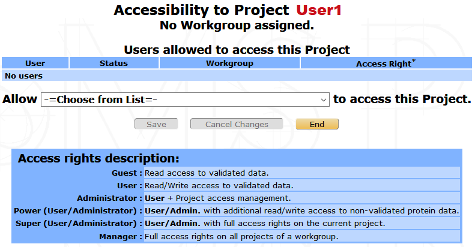

Projects settings
=================

All MS search results and data subsequently generated are organized in projects. A project regroups sets of data that belong to the same user or group of users and generated in the context of a defined scientific project. End-user (biologists and managers outside their workgroup) accessibility to the data is defined at the project level.

	
Selection
---------

From myProMS main window, follow the Projects link to display the Project selection interface.

For biologists, a straightforward list of the projects they have access to will be displayed.
For other classes of users, projects can be organized based on the following topics: Workgroups (default), Project owners, Active projects and Archived projects. Corresponding projects are listed by ascending name. Their description, owner and/or workgroup together with the access credentials of current user.
If On-going analyses is selected, the list generated is composed of Analyses still undergoing validation. Their name, description, data file name, creation date and corresponding project are displayed. This list can be sorted by Import date, Name, MS type, Validation status and Data file name.

Alternatively, a Search can be performed using various criterias:

Projects are then listed together with the items that were matched during the search.
Once listed, click on the ``Open`` button to go to the selected project.

Creation
--------

Only bioinformaticians, massists and data managers can create projects.
From the Project selection interface click on the ``Create a new Project`` button. The following form is then displayed:

- **Name**: Provide a mandatory name for the project.
- **Description**:  an optional description for the project.
- **Protein visibility**: Specify the project-wide protein visibility rule to be used. See Match groups and protein visibility below for detailed information on this concept.
- **Identifier conversion**: myProMS tries to map protein identifiers to their synonyms in multiple biological resources. If a conversion is selected, the default identifiers used for protein sequence identification during the MS search process can be replaced by synonyms more meaningful to end users. Unmapped identifiers will not be changed.
- **Relevant PTMs**: Post-translational modifications relevant to project can be selected here. The list of selectable modifications can be modified in Sequence Modification section. Information regarding relevant modifications will then be available when performing multiple tasks such as listing, comparing, quantifying and displaying proteins or modification sites. 
- **Project owner**: Specify the owner of the project here. This information can be used to sort projects in the projects selection window.
- **Workgroup**: Specify which workgroup this project should belong to if any.
- **Comments**: an optional comments for the project.

Click on the ``Save`` button to create project.

.. note:: Projects can be edited at any time to modify any of these settings.

Accessibility
-------------

Bioinformaticians and massists have full access to all projects recorded in myProMS. 
Data managers have full access to all projects within their workgroup. 
Biologists and managers outside their workgroup must be explicitly granted access to projects when needed. 
The project access management interface is accessible from the project’s home page by clicking on the ``Project Accessibility`` button in the option frame.

The interface summarizes the list of users able to access the project together with their credentials. 
New users can be added one at a time. Once added to the access list, users are guests by default. 
Select the credentials you wish to provided each user with. The access rights available are listed below the user access form. 
See also :ref:`users_access` for more information.

Click on the ``Save`` button to validate any changes.

Organization
------------
 
Data in a project are hierarchically organized as shown in the figure below:

.. _project_experiments: 

**Experiments**
***************

An Experiment item represents an actual biological experiment for which MS data will be collected.
To create a new experiment, select the project element in the top left navigation frame and click on ``Add Experiment(s)`` in the option frame.

Provide a name and optional description and/or comments. 
Multiple experiments can be created at once if the field Multiple entries labels is filled in. 
Labels defined in this field will be sequentially appended to the name each experiment created. 
Labels can be defined individually using a comma-separated string (eg. "A,D,G") or a range string using a '-' (eg. "1-5");

**Samples**
***********

A Sample item is a "loose" entity that can represent a single or multiple mixed (e.g. for labelled quantification) biological samples. It can be viewed as a sub-experiment or  Analysis-containing item. It is up the user to define its function depending on the experimental context of the analyses it contains.
To create a new sample, select its parent experiment in the navigation frame and click on ``Add Sample(s)`` in the option frame.

Provide a name and optional description and/or comments. 
Multiple samples can be created as described for experiments (see :ref:`project_experiments`).

**Analyses**
************

An Analysis corresponds to a dataset imported from a single search engine result file: mostly the MS/MS spectra (except for PMF runs), the peptide/protein identifications and associated quantifications when present in the file. 
Analysis data must be **imported, validated and reported** before end users can access them and further process their results. These procedures are described in the chapter Analysis data import and validation below.

Navigation
----------

- Navigation frame
- Sub-navigation frame
- Option frame
- Results frame

.. warning:: A COMPLETER

Life span
---------

- **On-going**: Once created, a project is set as active and on-going. This means that it can be populated with new items and data. On-going projects are flagged with a yellow icon in the project selection window.
- **Ended**: If the project is judged completed, it can be edited and ended by clicking on the End button at the bottom of the edition form. Ending a project will automatically end all partially-validated analyses without new reporting (see Validations and Reporting sections in the Analysis management chapter below for more information). Once ended, a project is still active and accessible but can no longer be edited or populated. Ended projects are flagged with a green icon in the project selection window.
- **Archived**: As time passes, some project might no longer be accessed by any users. These projects can be archived to save space on the server. All data files stored outside the database will be compressed. Archived projects are flagged with a red icon and are no longer accessible for data exploration. They can however be listed in the Project selection window by selecting “List of: Archived projects”.
- **Restoration**: Archived and Ended projects can be fully restored to any activity state if necessary by clicking on the appropriate button in the project home page.