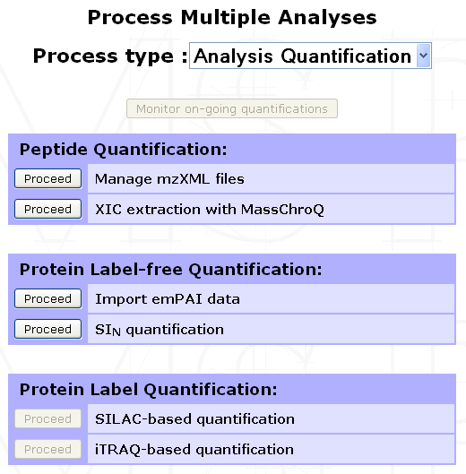
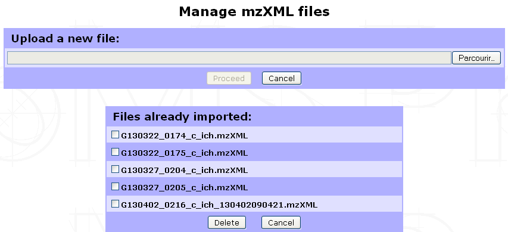
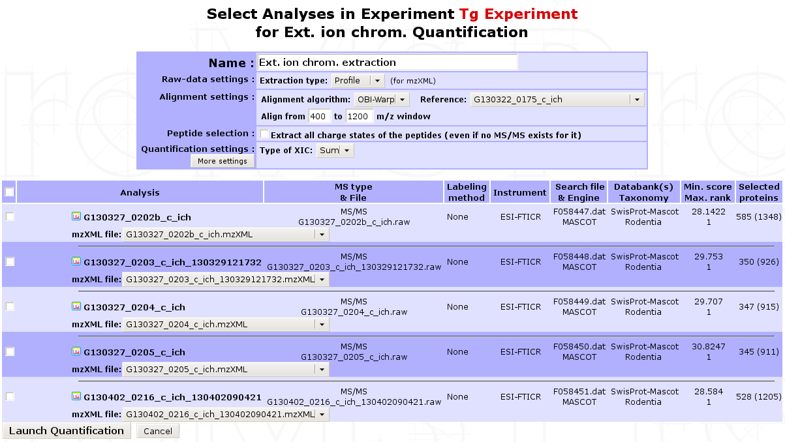
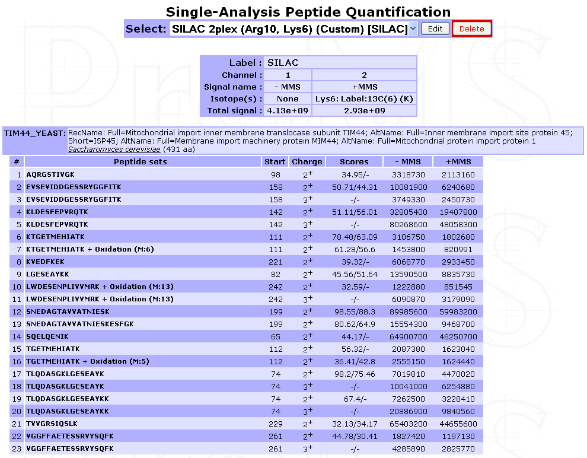
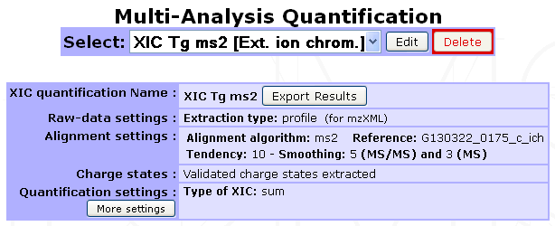

.. |br| raw:: html

     

.. _peptide_quantification:

Peptide Quantification
======================

Peptide quantification is a necessary step for peptide-based protein quantification; whether the quantification is based on MS-spectra (SILAC, TnPQ, XIC-based label-free quantification,...) or on MS/MS fragments (iTRAQ, TMT, SWATH...).

Data import from search results file
------------------------------------

Some search result files already contain peptide quantification data. 
It is always the case for MS/MS fragment-based quantification such as iTRAQ for which the peptide ion intensities are part of the MS/MS spectrum data. 

Some search results files (*Proteome Discoverer MSF* or *MaxQuant*) may also contain peptide XIC data if a quantification was performed after the search process. 
When peptide quantification data are contained in the imported search results file(s) myProMS will automatically import these data either during search data import or at the ``Validated data Report`` step if data validation must be performed. 

Only quantification data related to validated peptide will be kept (see the Virtual peptides section below for important additional information).

Data extraction from LC/MS file with MassChroQ
----------------------------------------------

XIC-based peptide quantification can be performed within myProMS whether or not peptide quantification data were already available in the search results file. myProMS uses the tool **MassChroQ** [1]_ to perform this task. However, the corresponding LC/MS file(s) must be provided in **mzXML** format.

Managing mzXML files
^^^^^^^^^^^^^^^^^^^^

To manage the list of mzXML files available within a given project, select any *Experiment* or *Sample* from the project navigation window and click on the ``Process Analyses`` button in the option frame. From the selection menu displayed, select ``Analysis Quantification`` to display the list of available options. Click on ``Proceed next`` to the Manage mzXML files process as shown below.

The following form will be displayed to allow you to either *import* a new mzXML file or *delete* already imported ones.

.. note:: 
	We perform LC/MS files (RAW & WIFF formats) conversion to mzXML with `ProteoWizard <http://proteowizard.sourceforge.net/>`_ tool using default settings. Other format conversion tools were not tested. We also recommend not to change the files name (except for the mzXML extension) to ease Analysis/mzXLM file matching in the quantification launch step.
	
Running XIC extraction
^^^^^^^^^^^^^^^^^^^^^^

Go to the ``Analysis Quantification`` options (as shown above) and click on ``Proceed`` next to the **XIC extraction with MassChroQ** process to display the form shown below.
 

 
In the first part of the form, multiple parameters can be set for the extraction:
	- **Name of the quantification** : All extraction data collected will be regrouped in a single quantification carrying this name.
	- **Extraction type** : Profile or centroid
	- **Isotope labeling** : If isotope labeling was performed on your sample, it is possible to use XIC extraction to retrieve it. To do so, you need to choose ``SILAC``. Up to 3 different channels can be retrieved at a time (e.g. *heavy*, *light* and *medium*) that have to be named. For each channel, one or more quantification label can be added given the experimental design. Each quantification label is linked to a post-translational modification that explains it. Specify the modification target on which it occurs (*side chain*, *n-ter* or *c-ter*). If side chain is chosen, don’t forget to give the residue where the post-translational modification occurs.

		Here is provided an example of the filled form in a SILAC experiment where lysine and arginine residues were designed as heavy isotope. 13C6-15N4 was renamed to Arg10 for clarity. 

		.. important:: 
			It is really important at this stage to define a light channel if a biological experiment/condition/analysis match the light version. Otherwise, the light version of the peptide will not be retrieved in the end.

		.. image:: img/run_silac.jpg

		|br|
		
		.. note::
			Your modification is not selectable in the modification target option ? Check the status of the modification (see Sequence modification section below). Maybe the modification you are using is not tagged as label. If not, change this and save it by editing the modification.
	
	- Alignment settings: Multiple LC/MS runs can be quantified at once. MassChroQ can align all runs to match features across different runs. User must provide an alignment algorithm (OBI-Warp or ms2), a reference run by selecting the corresponding analysis and an m/z window (for OBI-Warp algorithm).
	- Peptide selection: Whether to extract or not all charge states of a given peptide.
	- Type of XIC extraction to be performed: basePeak area (most intense peak in the range of masses) or TIC area (summed intensity across the range of masses).
	- More settings are also available by clicking on the corresponding button.

Finally, click on ``Launch Quantification`` to start the extraction. A pop-up window will appear to allow you to monitor the quantification progress. XIC extraction is a long process that can last up to an hour or more depending on the number of Analyses to be aligned, the complexity of the LC/MS run and the computer power available. You can continue using myProMS in the mean time and even launch other quantifications. All on-going quantification jobs are displayed in the ``Monitor Quantifications`` window (see figure below). 

<Figure Monitor Quantification window>

.. note:: 
	As new jobs are launched or old ones completed, they will appear or disappear from the list. Additionally, if an error occurs during quantification, a message will appear for the corresponding job. The user will be able to display the content of the error message and delete the failed job and all associated temporary data.

If this window is closed inadvertently (closing it has no effects on the on-going jobs) or did not appear (pop-up windows for myProMS URL must be enabled in your browser), it can be displayed again by clicking on the ``Monitor on-going quantifications`` button in the ``Analysis Quantification`` options (``Process Analyses`` > ``Analysis Quantification``).

In the second part of the form, you must select the analyses corresponding to the extraction and associate its mzXML file to each of them. 
If the mzXML file name matches the MS data file recorded for the Analysis, myProMS will do the job for you.
(Check the `MassChroQ manual <http://pappso.inra.fr/bioinfo/masschroq/manual/index.html>`_ for help on setting these parameters properly).

.. note:: 
	Only runs with reproducible retention-time values (e.g biological or technical replicates) should be selected for alignment. Runs potential very different set of feature (e.g.sample  fractions separated on a gel) should be extracted separately.
	
Virtual/Ghost peptides and proteins
-----------------------------------

During the quantification process, intensities of parent ions can be calculated even though the corresponding peptide did not end up in the list of peptides validated. For instance, in the case of a SILAC-labeled analysis, the label-free form of a peptide can be validated but not its labeled counterpart; either because the later falls under the threshold score used or was not identified at all. 
However, these data are valuable for the quantification since both peptide forms are required for ratio calculation. 

.. note:: 
	*myProMS* solves this issue by adding these missing peptides to the list of validated peptides but with a special status: **virtual peptides** (also called **ghost peptide**). 
	
This strategy of peptide addition also applies to alternative charge states of a given peptides (e.g. if the 2+ charge state of a peptide is validated, all other quantified charge states will be added as virtual peptides). Virtual peptides remain hidden unless their presence is required for proper data interpretation.

.. important::
	When applied to a label-free quantification where 2 or more analyses are aligned, a peptide validated in the reference analysis but missing (or not validated) in an aligned one can be reextracted as a **virtual peptide**. If this peptide does not belong to any validated proteins of the aligned analysis, the protein(s) matching this peptide in the reference will be added to the analysis aligned as **ghost protein(s)**. Ghost proteins appear in italics in most protein lists.

Displaying peptide quantification data
--------------------------------------

Once the peptide quantification data are available (after a **Report** for Search file extraction or an **XIC extraction** within myProMS), they can be displayed for individual analysis by selecting the corresponding analysis in the ``Project navigation`` frame and clicking on the ``Internal Quantifications`` button in the option frame. 

From new window displayed in the result frame, select the name of the quantification (in the ``Peptide quantification`` section). A window similar to the one below will be displayed showing a summary of the quantification parameters used (if any: no parameters are displayed in case of a direct extraction from a search results file) and a list of proteins with identified peptides and corresponding XICs or fragments area for DIA extraction. In case of labeled quantification, peptide sets (label isoforms) are grouped into a single peptide row. The peptide set sequence, variable modification, position, charge, score(s) and XIC(s) are displayed.

	
	*Legend: Case of a direct extraction of SILAC-labeled peptide XIC from a search result file*

Virtual peptides can be easily identified as they do not have score.

	
	*Legend: Case of a MassChroQ extraction with alignment of multiple Analyses*

.. [1] MassChroQ : `Valot B et al, Proteomics, 2011 <http://www.ncbi.nlm.nih.gov/pubmed/21751374>`_