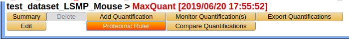
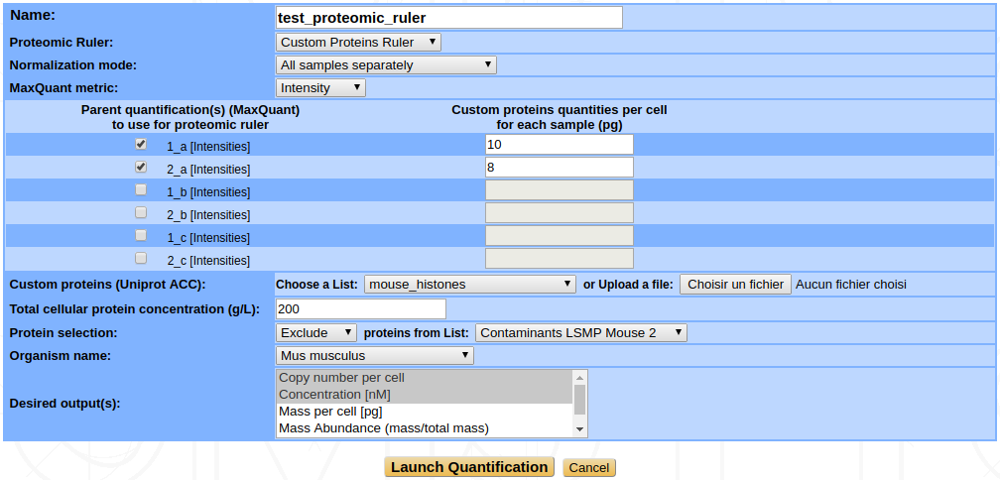
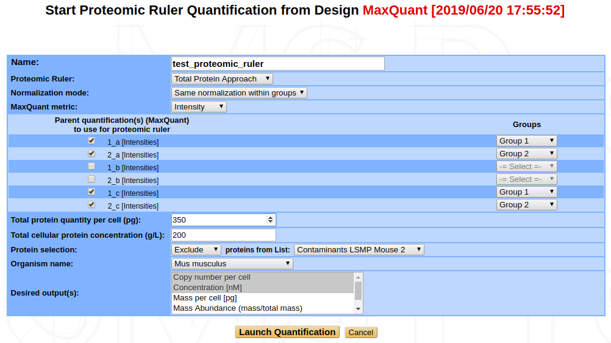
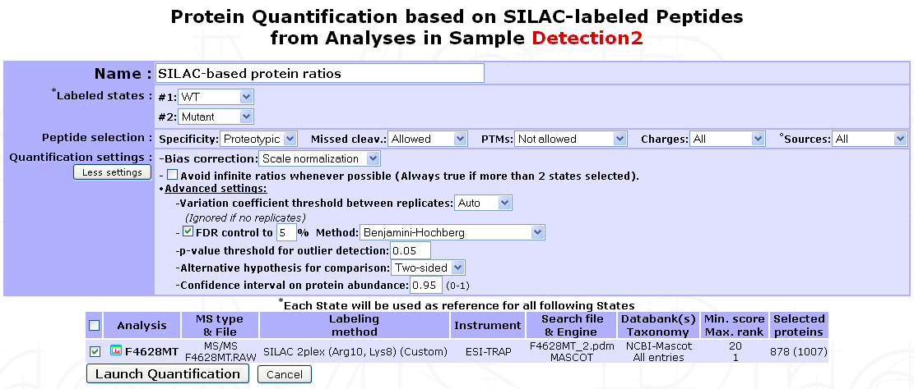
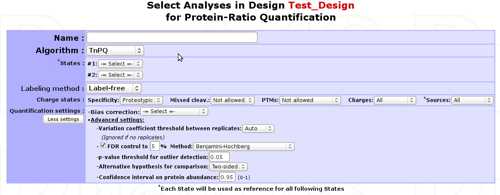
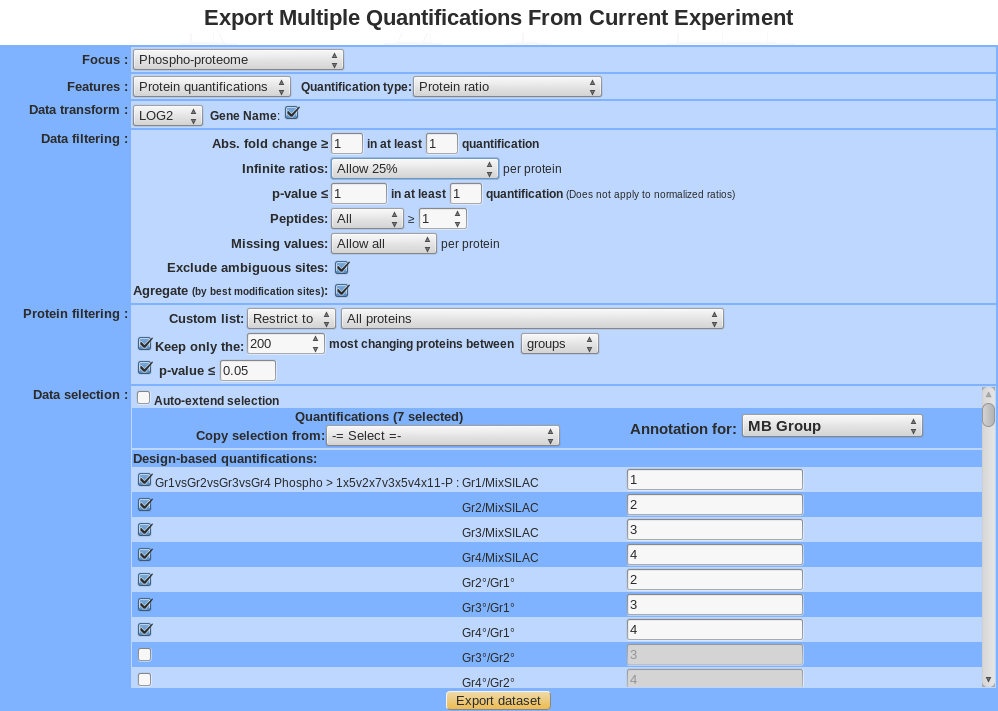

Protein Quantification
======================

Absolute abundance quantification
---------------------------------

emPAI (label-free)
^^^^^^^^^^^^^^^^^^

The **E**\ xponentially **M**\ odified **P**\ rotein **A**\ bundance **I**\ ndex (emPAI) is a spectral-count method that estimates the relative quantitation of proteins in a complex mixture\ [1]_ based on protein coverage by peptide matches. myProMS uses the built-in implementation of the Mascot server 2.3 software which is a slightly modified version of the original emPAI value (for more details, have a look to `mascot help <http://www.matrixscience.com/help/quant_empai_help.html>`_ ). As this value is retrieved from Mascot web-server, this label-free method can only be applied to Analyses generated from Mascot DAT files directly imported from a connected Mascot server.

SIn (label-free)
^^^^^^^^^^^^^^^^

The Spectral Index Normalized (SIn) is a normalized label-free quantitative method which combines three abundance features : peptide and spectral count with fragment-ion (MS/MS) intensity\ [2]_ . This label-free method is currently available only for Analyses generated from Mascot DAT files. Support for other search results formats is plan in future versions of myProMS.

MaxQuant: Intensity, LFQ, iBAQ 
^^^^^^^^^^^^^^^^^^^^^^^^^^^^^^

Proteomic Ruler
^^^^^^^^^^^^^^^

The Proteomic Ruler yields absolute quantification values such as protein copy number per cell, concentration or mass of protein per cell but it can also give abundance values or ranks of abundance in the sample. The idea is that the quantity of a specific protein compared to all the proteins in the sample is proportional to the protein intensity, measured by MS, compared to the total MS signal. 

.. image:: img/proteomic_ruler_init.png

Thus, the computation of quantification values is based on previous measures of intensities, typically ``Intensity`` or ``LFQ`` values as output by MaxQuant (see `MaxQuant: Intensity, LFQ, iBAQ`_ above). For this reason, the Proteomic Ruler is available only from a MaxQuant design, with quantifications already computed. 

**Proteomic Ruler Type** : You can choose between three different methods of Proteomic Ruler : the ``Total Protein Approach``, the ``Histone Proteomic Ruler`` or the ``Custom Proteins Ruler``. 

- **Total Protein Approach** : This is based on the work of *Wiśniewski et al., 2012* [3]_\ . The copy numbers per cell are determined by comparison of the individual intensities with the sum of all the MS intensities, then dividing this ratio by the molecular weight and multiplying by the Avogadro constant and by the total protein content (mass) of a single cell. Therefore you must specify this total protein content per cell as input. The formula is then :

.. math::

	{Protein\ copy\ number\ per\ cell} = {Total\ amount\ of\ proteins\ per\ cell}\ \cdot\ \frac{N_A}{M}\ \cdot\ \frac{Protein\ MS\ intensity}{Total\ MS\ intensity}

- **Histone Proteomic Ruler** : Wiśniewski and colleagues published this as an extension of their *Total Protein Approach* in 2014 [4]_\ . Instead of relying on a user-given total amount of proteins per cell (most probably calculated from the total amount of proteins in the sample and the number of cells in the sample), the *Histone Proteomic Ruler* is based on the **Histone MS signal** and on the **ploidy** of the studied cells. 

  In their paper, *Wiśniewski et al*. show that the **total protein mass per cell** can be estimated from the **cellular DNA mass** and the ratio of the **Histone MS signal** to the **Total MS signal**, following the formula :

  .. math::

	{Cellular\ protein\ mass} = {Cellular\ DNA\ mass}\ \cdot\ \frac{Total\ MS\ signal}{Histone\ MS\ signal}

  For a specific cell type, we can obtain the **amount of DNA per cell** from the **genome size** and the **ploidy** of the cell type. For example, for a diploid human cell, considering a genome size of :math:`3.2\cdot10^9 bp` and an average base pair weight of :math:`615.8771 Da`\ , the expected amount of DNA is approximatively :math:`6.5 pg/cell`\ . 

  Once the **total protein mass per cell** has been computed, the estimation of absolute copy numbers per cell is then obtained in the same way as for the *Total Protein Approach* (see above). 

  .. warning::
	Because this method relies heavily on the histone content of the sample(s), *Wiśniewski et al.* state in their paper that for accurate results, *"the only prerequisite is a eukaryotic, whole-cell proteome dataset where the chromatin fraction is not over- or underrepresented as a result of sample handling"* and that *"a reasonable depth of proteomic analysis is needed to ensure a robust contribution of the histone MS signal"* (depth of around 12 000 peptides).

- **Custom Proteins Ruler** : This method follows the same rationale as the two above, namely that the proportion of a given protein in the sample compared to the total protein content can be estimated from the proportion of its MS signal compared to the total MS signal (intensity). The only difference in this case is that instead of using the total protein content per cell or the cellular DNA mass/histone MS signal, the scaling is done with proteins of known quantity (hereafter referred to as **custom proteins**). You can use a spike-in or any other proteins of your sample as custom proteins, as long as you can provide the total quantity per cell of these proteins in each of your samples. 

  For example, let's say you want to quantify two samples, 1 and 2, and your custom proteins are protein A, B and C. In each sample you know that you have : 
	
	* :math:`100ng` of protein A,
	* :math:`70ng` of protein B,
	* :math:`30ng` of protein C,

  so a total of :math:`200ng` of custom proteins in each sample. However, you also have :

	* 20 000 cells in sample 1,
	* 25 000 cells in sample 2

  You will have to provide the software with your custom proteins identifiers (either a list that you have already saved or a text file with one identifier per line) and with the values : 

	* :math:`\frac{200\cdot10^{-9}}{20000} = 10pg` for sample 1,
	* :math:`\frac{200\cdot10^{-9}}{25000} = 8pg` for sample 2

**Normalization mode**: In the default mode, each sample is scaled individually according to the method you chose. If you quantify more than one sample at a time, you may want to normalize them in another way. Your different options are : 

- **All samples separately** : The default mode. A normalization factor is computed for each sample and applied to it individually. 

- **Same normalization for all** : A normalization factor is computed for each sample, but only the average of all these normalization factors is applied to scale the intensities of every sample. 

- **Same normalization within groups** : In an experiment, some samples are often related to some others, like biological replicates for instance. In that case, you may want to group related samples together and scale them according to the group they belong to. A normalization factor is thus computed for every sample and the average normalization factor of each group is retained to scale the data of samples from this group.

  This option requires that you later select the groups for each sample you want to quantify (see figure ...)

- **Average all samples** : This is a very particular case where the data (intensities) from all your samples is averaged (actually, the software takes the median intensities) for each protein before any other computation, which creates an virtual "average sample". The normalization is then done on this average sample. This mode yields a unique quantification value per protein, corresponding to the average sample. It is meaningful only in some particular cases, for example if you quantify only some biological or technical replicates together and want to have a global view on them. 

**MaxQuant metric** : This is the metric computed by MaxQuant on your samples and that you want to use as the basis for this quantification. You can choose between ``Intensity`` and ``LFQ`` metrics. The samples for which the chosen metric is available are displayed after selection of the metric.

**Total cellular protein concentration** : To compute concentration values for each protein, the software calculates the volume of the sample. To do so it needs the protein concentration of your sample in g/L.

**Protein selection** : Use this feature if you want to exclude one of your lists of proteins from the quantification before launching the computation, or, on the contrary, if you want to restrict the considered proteins to a specific subset. For example, you can exclude contaminants. You need to previously create your own list of proteins (see :ref:`user_defined_lists`) to use this feature.

.. warning::
	**You should not exclude proteins that are not contaminants** because the Proteomic Ruler relies on the total MS signal to quantify the proteins. If you exclude viable proteins that were in your samples, your results will not be accurate and some features such as *Mass* or *Molecular abundance* will simply become meaningless. Do not exclude proteins only because you don't need to quantify them. 

**Organism name** : Provide the name of the organism from which your proteins are from (used mostly with the Histone Proteomic Ruler method).

**Desired output** : Select at least one type of quantification value that you are interested in. You can select multiple outputs by maintaining the mouse button clicked during the selection or by clicking on multiple features while holding the ``Ctrl`` key on your keayboard. The quantification types available are ``Copy number per cell``, ``Concentration``, ``Mass per cell``, ``Mass Abundance``, ``Molecular Abundance``, ``Copy number rank`` and ``Relative copy number rank``.

.. note::
	The *Copy number per cell* is the basis to compute all the other quantification values, so it will be computed anyway. We suggest that you select it even if that is not the main feature you are interested in.

Displaying single abundance quantification data
^^^^^^^^^^^^^^^^^^^^^^^^^^^^^^^^^^^^^^^^^^^^^^^

Relative abundance quantification
---------------------------------

Single-Analysis quantification (labeled)
^^^^^^^^^^^^^^^^^^^^^^^^^^^^^^^^^^^^^^^^

If a labeled Analysis has to be quantified, labeling parameters and all peptide XIC data should be readily available in the corresponding search results file. Therefore, a straightforward protein quantification can be performed as follow: Go to the ``Analysis Quantification`` options (``Process Analyses`` > ``Analysis Quantification``) and click on ``Proceed`` next to the ``(SILAC/iTRAQ)-based quantification`` process to display the quantification form shown below.

- **Name** : A name for the quantification.
- **Labeled states** : Select the different conditions to be compared. Available labeled states are identified based on labeling design extracted from the search result file. Each condition defined will be used as a reference for the following one(s). 1 state is usually associated with 1 condition. However, if more than 2 states are identified (e.g. iTRAQ 4/8-plex) an additional option will be displayed for grouping different states as replicates of the same condition. In addition, if more than 2 conditions are defined, all corresponding ratios will be calculated except reverse ratios (cond B/cond A but not cond A/cond B).

	.. note::
		It is possible to quantify multiple Analyses at once. Make sure they share identical labeling design. If not, they should be quantified separately.
		
	Multiple filter can be applied on Peptide selection:
	
		* Specificity : Whether to restrict quantification to proteotypic peptides or not.
		* Missed cleav. : Include or not miss-cleaved peptides.
		* PTMs : Peptides with sequence modification can be allowed, not allowed or extend exclusion to corresponding non-modified peptide.
		* Charges : Include all charge states of a peptide set or restrict to set that gives the best signal (set containing peptide with highest XIC value).
		* Sources : If the search results files is a merge of multiple LC/MS runs (e.g. Proteome Discoverer), use peptide sets from all runs or use only the one with best signal.
	
- **Quantification settings** : Additional options are available to control experimental bias, outliers detection and differential analysis.
	
	* **Bias correction** : Select whether to correct or not for signal bias between label states and which method to apply: If ``Scale normalization`` is selected, the assumption is made that the total XIC signal between all states should be equal. Alternatively if ``Reference protein(s)`` is selected, a pre-recorded List of proteins must be provided. When using this option, it is assumed that a subset of proteins (e.g. House keeping proteins) is unchanged amongst all states and therefore only the sums of the XICs matching these proteins are set equal. In both cases, a state-specific correction factor is computed and applied to each individual peptide XIC.
	* **Avoid infinite ratios** : Infinite ratios (log values) can occur when XIC values are missing in 1 of the 2 conditions being compared. When a mixture of normal and infinite peptide ratios exists for the same protein, myProMS must either use the most abundant type of ratios to quantify the protein (e.g. set protein ratio to +/-infinite (log values) if more than 50% of matching peptides have infinite log ratios) or only use the "normal" ratios even if they are less frequent that the infinite ones (to **avoid infinite ratios whenever possible**\ ). This later option is automatically selected if more than 2 conditions are compared to prevent excessive data exclusion.
	* **More advanced settings** can be used for **outlier** detection, comparison hypothesis test (Two-sided/Lesser/Greater), **FDR** control, ...

Finally, select the analysi(e)s to be quantified. If multiple peptide quantification datasets are available for an Analysis, one must be selected. Click on the ``Launch Quantification`` button. Multiple quantifications will be queued and processed as up to 3 parallel jobs. As described above for :ref:`peptide_quantification`, a popup window will appear with the list of all jobs launched with their progress status.

Design-based quantifications
^^^^^^^^^^^^^^^^^^^^^^^^^^^^

The use of a design for a quantification is highly recommended, even if it requires only single labeled analysis. It is mandatory to create a design for a quantification that requires more than 1 analysis. Designs are automatically generated when importing protein quantification data from  MaxQuant analyses.

Conditions

Observations

Displaying relative abundance quantification data
^^^^^^^^^^^^^^^^^^^^^^^^^^^^^^^^^^^^^^^^^^^^^^^^^

Label-free quantifications
--------------------------

Label-free quantifications are methods that allow to determine the relative amount of proteins in two or more biological samples without any use of stable isotope or chemical tag. It is based on precursor signal intensity or the number of spectra made for each peptide of a protein.
Here is a brief description of several methods available in myProMS that you can use from top panel button ``Process Analyses`` and then, ``Analysis Quantification``.

TnPQ
^^^^

Silva et al. showed in their work\ [5]_ on a Q-ToF type instrument that it is possible to quantify unknown protein samples with a known unified signal response factor in absolute manner . Then, the **T**\ op **3** **P**\ rotein **Q**\ uantification\ [6]_ extended this method to ion trap instruments. The method premises that for each protein identified by a set of peptides, the average of the three most efficiently ionized and therefore highest MS signals directly correlated with the input amount of the corresponding  protein. In myProMS, we extended this definition to “all available peptides” for a given protein and called it TnPQ.

Steps involved in TnPQ computation:

	#. Retrieval of all available XICs (area) of each peptide of the protein for all conditions
	#. Removal of incomplete peptide information i.e. peptide with no XIC information in at least one of the replicates of a condition will be removed

		.. warning:: 
			when creating a quantification, avoid to add too many conditions because you will lose a lot of peptide information given the fact that all conditions must provide a XIC for a peptide to be considered more further
			
	#. If a bias correction setting was selected (scale or reference protein normalization), a normalization step is introduced by computing bias estimates on unique peptides [7]_ . All XIC are divided by those bias factors.

		.. note:: 
			If None was chosen, nothing is done to the data
			
	#. Removal of extreme XIC values (outliers) based on the coefficient of variation (standard deviation divided by the mean) of all identified peptides along the replicates in the conditions.
	#. Compute for each protein the geometrical mean of peptide XICs
	#. Quality control of the data (normality test on the data and variance sameness)
	#. Compute the ratio between paired conditions and make a test to assess equality of mean depending on the design made before
	
		* For 2 conditions : use Student t-test comparison (or Welch t-test if variance are not the same)
		* For more than 2 conditions : use Tuckey HSD (honestly significant difference) test
		
	#. If chosen, adjust p-values to control FDR level

Comparing multiple protein quantifications
------------------------------------------

Exporting multiple quantifications
----------------------------------
 

 
- For the explanation of all features see section “Exploratory analyses” except for the following item:

	* Gene Name : transform all protein name in gene name (<which?geneID/unigene>).
	* Keep most changing proteins between:

		+	Sample: For a given isoform (or protein), a standard deviation is calculated for all selected sample and only the isoform (or protein) with the best value is kept. The standard deviation is a measure that is used to quantify the amount of variation or dispersion of a set of data values. 
		+	Group: For a given isoform (or protein), an Anova is applied, a p-value is calculated between group. Analysis of variance (ANOVA) is a collection of statistical models and their associated procedures (such as "variation" among and between groups) used to analyze the differences among group.

- After clicking on ``export dataset`` button, a compressed directory is downloaded which contains following file :

	* R_parameter.txt: all the parameters used by the statistical analysis.

		.. image:: img/export_r_parameter_file.png

	* parameter.txt: all the parameters used for data filtering.

		.. image:: img/export_parameter_file.png

	* matrix_pvalue_processed.txt: 

		.. image:: img/export_matrix_pvalue_processed_file.png

	* matrix_pep_processed.txt: peptide number

		.. image:: img/export_matrix_pep_processed_file.png 

	* matrix_log2ratio_processed.txt:

		.. image:: img/export_matrix_log2ratio_processed_file.png 

	* annotation_processed.txt:

		.. image:: img/export_annotation_processed_file.png

	* sd.txt: standard deviation value (between sample)

		.. image:: img/export_sd_file.png 
		
		
-----------------------------------------------------------------------------
		
.. [1] emPAI : `Hishima et al, Mol Cell Proteomics, 2005 <http://www.ncbi.nlm.nih.gov/pubmed/15958392>`_
.. [2] SIn : `Griffin NM et al, Nat Biotechnol., 2009 <http://www.ncbi.nlm.nih.gov/pmc/articles/PMC2805705/>`_
.. [3] Total Protein Approach : `Wiśniewski et al, Mol Syst Biol., 2012 <https://www.ncbi.nlm.nih.gov/pubmed/22968445>`_
.. [4] Histone Proteomic Ruler : `Wiśniewski et al, Mol Cell Proteomics, 2014 <https://www.ncbi.nlm.nih.gov/pubmed/25225357>`_
.. [5] TnPQ : `Silva et al, Mol Cell Proteomics, 2006 <http://www.ncbi.nlm.nih.gov/pubmed/16219938>`_
.. [6] T3PQ : `Grossmann et al, J Proteomics, 2010 <http://www.ncbi.nlm.nih.gov/pubmed/20576481>`_
.. [7] TnPQ bias correction (scale normalization part) : `Yang et al. 2002 <http://www.ncbi.nlm.nih.gov/pmc/articles/PMC100354/>`_
