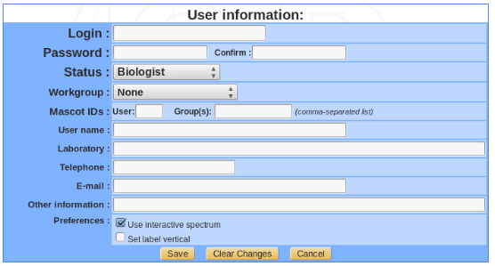

Users management
================

.. _users_access:

User classes and access privileges
----------------------------------

Data access in myProMS is tightly controlled at the user-level to insure data privacy and integrity. 
Multiple classes of users are defined based on expertise required to perform the different data/users management and processing tasks available in myProMS. 
In addition, within certain classes, users can be granted additional privileges if their expertise MS data processing justifies it.

There are 4 classes of users defined in myProMS ordered by decreasing access privileges: bioinformaticians, massists, data managers and biologists.

**Bioinformaticians**
	
	This class of users is intended for server administration and annotation data management. Although bioinformaticians have full access to all functionalities of myProMS, they should not be used to perform routine data processing such as MS data validation has they might not have the necessary expertise. We recommend to keep the number of bioinformatician accounts as low as possible due to their extended ability to modify the data,
	
**Massists**
	
	The massist class represents MS experts who are in charge of MS data import, validation and reporting. Massists also manage user accounts and projects creation.  By default massists have access to all myProMS functionalities except those normally dedicated to bioinformaticians. 

**Data managers and workgroups**
	
	Data managers have the same privileges as massists but restricted to projects and users of their workgroup. Workgroup usage is optional but is particularly useful for multiple MS-based research labs sharing a common MS facility. In that case, a single instance of myProMS with a workgroup attributed to each lab will insure data privacy while maintaining management centralisation by the MS facility.
	
**Biologists**

	Biologists are end users of myProMS. They have access to the projects they participate to with various levels of privileges depending of their expertise and involvement in each project. Project access privileges for biologists come in multiple flavors:
	
		Project involvement-based privileges:
			- **Guest**: A guest user can only access the project data but cannot modify them.
			- **User**: Can access and modify project data.
			- **Administrator**: Same as a user. In addition, a project Administrator can grant other users access to project.
		
		Expertise-based privileges:
			Biologists (users and administrators) can be granted partial access to MS data validation if their knowledge of the procedures involved is judged sufficient:

			- **Power** (User/Administrator): Can enter “Validation” mode to validate protein identification data only.
			- **Super** (User/Administrator): Can enter “Validation” mode to validate both protein and peptide identification data.

Account management
------------------

From myProMS main window, follow the Users link (this link is named Account for biologists). 

Once in the User section, users can either edit their account and change their password. 
Massists and managers can view and modify other users accounts and create new ones. 

.. note:: A user cannot create an account class higher than its own (eg. a manager cannot create a massist account).

A bioinformatician can be grant extended privileges to a massist or manager to allow this user to perform specified annotation management tasks. 
In addition, if Mascot is used with group and user ids enabled, this information can be specified for each massist and manager to insure equivalent data access restriction when importing Mascot data directly from myProMS.
